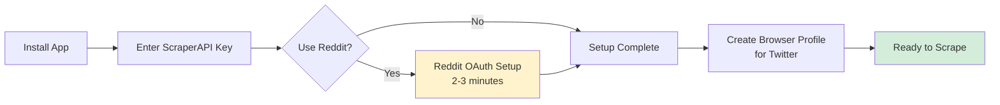
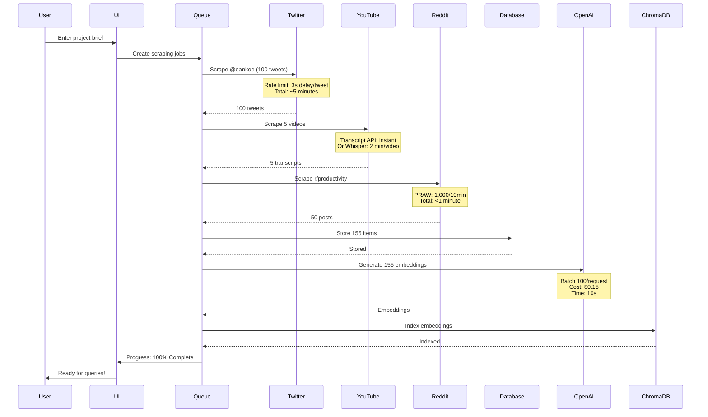
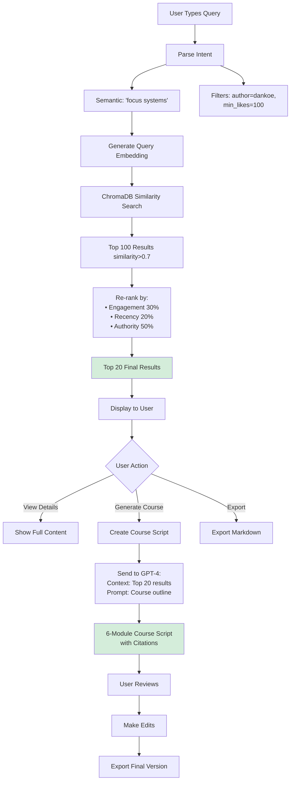

# User Flow Diagram - How Research Actually Works

**Updated**: 2025-11-16
**Purpose**: Show the actual user journey from "I need content ideas" to "Here's my course script"

---

## Primary User Flow (Happy Path)

```mermaid
graph TD
    Start([User: "I need to research focus systems"]) --> Input[Enter Project Brief]

    Input --> Brief{Brief Contains}
    Brief -->|Topic| T[Topic: "Focus Systems"]
    Brief -->|Audience| A[Audience: "Knowledge Workers"]
    Brief -->|Format| F[Format: "Video Course"]

    T --> Detect[Auto-Detect Authorities]
    A --> Detect
    F --> Detect

    Detect --> Auth[Authorities Found:<br/>• Dan Koe Twitter<br/>• Cal Newport Blog<br/>• James Clear Newsletter]

    Auth --> Scrape[Scrape All Sources]

    Scrape --> T1[Twitter: 100 tweets from @dankoe]
    Scrape --> Y1[YouTube: 5 videos transcripts]
    Scrape --> R1[Reddit: 50 r/productivity posts]
    Scrape --> W1[Web: Cal Newport blog 20 articles]

    T1 --> Normalize[Normalize to Unified Schema]
    Y1 --> Normalize
    R1 --> Normalize
    W1 --> Normalize

    Normalize --> Store[Store in PostgreSQL]
    Store --> Embed[Generate Embeddings]
    Embed --> Index[Index in ChromaDB]

    Index --> Analyze[LLM Analysis]
    Analyze --> Extract[Extract:<br/>• Frameworks AIDA PAS BAB<br/>• Hooks curiosity-driven<br/>• Pain Points "can't focus"<br/>• Solutions "2-hour blocks"]

    Extract --> Patterns[Detect Patterns]
    Patterns --> P1[Cross-Platform Elaboration:<br/>Tweet → Newsletter → Video]
    Patterns --> P2[Authority Ranking:<br/>Dan Koe 1M followers high engagement]
    Patterns --> P3[Content Gaps:<br/>Missing: "Focus for ADHD"]

    P1 --> Query[User Queries RAG]
    P2 --> Query
    P3 --> Query

    Query --> Q1["What does Dan Koe say<br/>about focus?"]
    Q1 --> Results[Top 10 Results:<br/>• Tweet: "2-hour blocks"<br/>• Video: "Focus framework"<br/>• Newsletter: "Attention diet"]

    Results --> Generate[Generate Course Script]
    Generate --> Script[6 Modules:<br/>1. Focus Crisis<br/>2. 2-Hour Blocks<br/>3. Deep Work Tools<br/>4. Attention Management<br/>5. Recovery Systems<br/>6. Implementation Plan]

    Script --> Export[Export Markdown]
    Export --> Done([User: "Perfect! Ready to film"])

    style Start fill:#e1f5ff
    style Done fill:#d4edda
    style Scrape fill:#fff3cd
    style Analyze fill:#f8d7da
```

---

## Failure Points (What Actually Happens)

```mermaid
graph TD
    Start([User Starts Research]) --> Setup{First Time?}

    Setup -->|Yes| OAuth[Reddit OAuth Setup]
    OAuth -->|Confused| Abandon1[❌ 30% Abandon Rate]
    OAuth -->|Completes| Twitter[Twitter Profile Setup]

    Setup -->|No| Twitter

    Twitter --> Scrape[Start Scraping]

    Scrape --> T1{Twitter Scrape}
    T1 -->|Anti-Bot Detected| Fail1[❌ 85% Fail Without IAC-024]
    T1 -->|Success| T2[100 Tweets Scraped]
    Fail1 -->|Retry with Proxy| T2

    T2 --> Y1{YouTube Scrape}
    Y1 -->|No Transcript| Fallback1[⚠️ Use Whisper 30% Slower]
    Y1 -->|Has Transcript| Y2[5 Videos Scraped]
    Fallback1 --> Y2

    Y2 --> R1{Reddit Scrape}
    R1 -->|Rate Limit Hit| Queue1[⏳ Queue for 2 min]
    R1 -->|Within Limit| R2[50 Posts Scraped]
    Queue1 --> R2

    R2 --> Embed{Generate Embeddings}
    Embed -->|500 Items| Cost1[💰 $0.50 OpenAI Cost]
    Cost1 -->|No Warning| Surprise[😡 User Surprised by Cost]
    Cost1 -->|Warning Shown| Proceed[✅ User Confirms]

    Proceed --> Store[Store in Database]
    Store -->|10K Rows| Slow1{Query Speed?}
    Slow1 -->|No Indexes| Timeout[❌ 30s Timeout]
    Slow1 -->|With Indexes| Fast[✅ <500ms Response]

    Timeout -->|User Retries| Slow1
    Fast --> Query[User Searches]

    Query --> Results{Results Quality?}
    Results -->|Random Order| Poor[😐 User Filters Manually]
    Results -->|Ranked by Engagement| Good[😊 Top Results Useful]

    Poor --> Generate[Generate Course]
    Good --> Generate

    Generate -->|3-Hour Podcast| BigCost[💰 $0.45 GPT-4 Cost]
    BigCost -->|No Chunking| Budget[😡 $45 for 100 Videos]
    BigCost -->|With Chunking| Cheap[✅ $5 for 100 Videos]

    Budget --> Angry([User: "WTF, I'm broke"])
    Cheap --> Happy([User: "This is amazing!"])

    style Abandon1 fill:#f8d7da
    style Fail1 fill:#f8d7da
    style Timeout fill:#f8d7da
    style Budget fill:#f8d7da
    style Angry fill:#f8d7da
    style Happy fill:#d4edda
```

---

## Detailed User Journey (Step-by-Step)

### Phase 1: Setup (First Time Only)



**Time**: 5-10 minutes first run, 0 seconds subsequent runs

---

### Phase 2: Research Execution



**Total Time**: 8-12 minutes for 155 items
**Total Cost**: ~$0.20 (embeddings + analysis)

---

### Phase 3: Query & Generation



**Query Time**: <2 seconds
**Course Generation**: 30-60 seconds
**Cost**: $0.05-0.10 per course script

---

## User Scenarios

### Scenario 1: Content Creator (Dan Koe Clone)

**Goal**: "I want to create Twitter threads like Dan Koe"

```
1. User: "Analyze Dan Koe's Twitter strategy"
2. System: Scrapes 500 tweets from @dankoe
3. System: Detects patterns:
   - Hook formula: [Curiosity + Specificity]
   - Thread structure: 8-12 tweets
   - Topics: Focus (40%), Business (30%), Writing (30%)
   - Best performing: "How I..." threads
4. System: Generates 10 thread templates
5. User: Selects template, adds their story
6. Output: Ready-to-post thread
```

**Time**: 15 minutes scraping + 5 minutes generation = 20 minutes total

---

### Scenario 2: Course Creator

**Goal**: "Create a course on productivity systems"

```
1. User: "Research productivity frameworks"
2. System: Auto-detects authorities:
   - Dan Koe (Twitter, newsletter)
   - Cal Newport (blog, books)
   - Ali Abdaal (YouTube)
   - David Allen (GTD)
3. System: Scrapes all sources (300 items)
4. System: Extracts frameworks:
   - GTD (Getting Things Done)
   - Time Blocking
   - 2-Hour Deep Work Blocks
   - Zettelkasten
5. System: Detects content gaps:
   - Missing: "Productivity for ADHD"
   - Opportunity: Combine GTD + Time Blocking
6. System: Generates 6-module course outline
7. User: Reviews, edits, exports
```

**Time**: 30 minutes research + 10 minutes generation + 20 minutes editing = 60 minutes total

---

### Scenario 3: Copywriter (RMBC Workflow)

**Goal**: "Write sales page using Research → Mine → Breakthrough → Create"

```
1. Research: Scrape competitor sites + reviews
   - 5 competitor products (Amazon reviews)
   - 100 customer reviews per product
   - Extract: Pain points, desires, objections

2. Mine: LLM extracts Voice of Customer (VOC)
   - Pain: "I waste 3 hours/day on emails"
   - Desire: "I want to focus on deep work"
   - Objection: "I tried apps, they're too complex"

3. Breakthrough: Pattern detection
   - Hook: "What if you could reclaim 3 hours/day?"
   - Framework: PAS (Problem-Agitate-Solution)
   - Proof: 487 reviews mention "time-saving"

4. Create: Generate sales page
   - Headline: Pain point + desire
   - Body: Agitate with stats from research
   - CTA: Address objection with social proof

5. User: Edits copy, launches campaign
```

**Time**: 20 minutes scraping + 15 minutes analysis + 10 minutes generation = 45 minutes total

---

## Key User Interactions (UI Elements)

### Dashboard View

```
┌─────────────────────────────────────────────────────────┐
│  Unified Scraper - Dashboard                            │
├─────────────────────────────────────────────────────────┤
│                                                          │
│  📊 Projects                                             │
│  ┌──────────────────────────────────────────┐          │
│  │ [+] New Project                          │          │
│  │                                           │          │
│  │ 📁 Focus Systems Course (155 items)      │          │
│  │    Last updated: 2 hours ago             │          │
│  │    Status: ✅ Ready                       │          │
│  │                                           │          │
│  │ 📁 Copywriting Research (487 reviews)    │          │
│  │    Last updated: 1 day ago               │          │
│  │    Status: ⏳ Analyzing                   │          │
│  └──────────────────────────────────────────┘          │
│                                                          │
│  🎯 Quick Actions                                        │
│  [Scrape Twitter]  [Scrape YouTube]  [Generate Course] │
│                                                          │
│  💰 Usage This Month                                     │
│  ScraperAPI: 12,450 / 100,000 credits (12%)            │
│  OpenAI: $3.45 / $50 budget (7%)                       │
│                                                          │
└─────────────────────────────────────────────────────────┘
```

### Scraping View (Real-Time Progress)

```
┌─────────────────────────────────────────────────────────┐
│  Scraping: Dan Koe Twitter Analysis                     │
├─────────────────────────────────────────────────────────┤
│                                                          │
│  Progress: [████████░░░░░░░░░░] 45/100 tweets          │
│  ETA: 3 minutes remaining                               │
│                                                          │
│  ✅ Scraped @dankoe profile                             │
│  ✅ Retrieved 45 tweets                                 │
│  ⏳ Rate limit: waiting 3s...                           │
│  ⏳ Generating embeddings (45/45)                       │
│                                                          │
│  💰 Est. Cost: $0.12 (embeddings)                       │
│                                                          │
│  [Pause] [Cancel]                                       │
│                                                          │
└─────────────────────────────────────────────────────────┘
```

### Query View

```
┌─────────────────────────────────────────────────────────┐
│  🔍 Search: "What does Dan Koe say about focus?"        │
├─────────────────────────────────────────────────────────┤
│                                                          │
│  Filters: [Author: Dan Koe ▼] [Platform: All ▼]        │
│           [Min Likes: 100 ▼] [Date: Last 6mo ▼]        │
│                                                          │
│  📊 20 results found (showing top 10)                   │
│                                                          │
│  1. 🔥 "The 2-hour focus block framework..." (5,234 ❤️) │
│     @dankoe • Tweet • 2 months ago                      │
│     Similarity: 94% | Engagement: High                  │
│     [View] [Add to Course]                              │
│                                                          │
│  2. 📺 "How I build focus systems" (Video)  (1,245 👍)  │
│     Dan Koe • YouTube • 3 months ago                    │
│     Similarity: 91% | Engagement: Medium                │
│     [View Transcript] [Add to Course]                   │
│                                                          │
│  3. 📝 "Deep work requires deep recovery..." (892 ❤️)   │
│     @dankoe • Tweet • 1 month ago                       │
│     Similarity: 89% | Engagement: Medium                │
│     [View] [Add to Course]                              │
│                                                          │
│  [Load More] [Export Results] [Generate Course Script] │
│                                                          │
└─────────────────────────────────────────────────────────┘
```

---

## Critical User Flow Questions (Answer These First)

### 1. How does the user specify what to scrape?

**Option A**: Manual entry
```
User enters:
- Twitter: @dankoe
- YouTube: Dan Koe channel
- Reddit: r/productivity
```

**Option B**: Auto-detection (RECOMMENDED)
```
User enters topic: "Focus systems"
System auto-detects:
- Twitter: @dankoe, @calebjoneshq, @dickiebush
- YouTube: Ali Abdaal, Thomas Frank
- Reddit: r/productivity, r/getdisciplined
```

**Option C**: Hybrid
```
User enters: "Focus systems + manual add @naval"
System suggests + allows custom additions
```

### 2. How does the user know scraping progress?

**Option A**: Background silent
```
User sees: "Scraping... (this may take a while)"
No progress bar, just waits
```

**Option B**: Real-time progress (RECOMMENDED)
```
Progress bar: 45/100 tweets
ETA: 3 minutes
Current: Waiting for rate limit (3s)
Cost so far: $0.08
```

### 3. How does the user query the data?

**Option A**: Natural language only
```
User types: "What does Dan Koe say about focus?"
System interprets + searches
```

**Option B**: Structured filters (RECOMMENDED)
```
User selects:
- Author: Dan Koe
- Platform: Twitter, YouTube
- Topic: Focus (auto-tagged)
- Date: Last 6 months
- Min engagement: 100 likes
```

**Option C**: Hybrid (BEST)
```
Natural language + visual filters
"Dan Koe focus" → Auto-applies filters → User can adjust
```

### 4. How does the user generate output?

**Option A**: One-click magic
```
[Generate Course Script] button
System decides everything
```

**Option B**: Guided wizard (RECOMMENDED)
```
Step 1: Select format (Course / Tweet Thread / Blog)
Step 2: Choose source content (select 10-20 items)
Step 3: Customize outline (6 modules / 10 tweets / 3 sections)
Step 4: Generate
```

---

## Next Steps

1. **Validate this flow with user** (you)
2. **Build MVP around critical path**: Setup → Scrape → Query → Generate
3. **Defer nice-to-haves**: Advanced ranking, cross-platform matching, cost optimization
4. **Test failure scenarios**: Twitter ban, no YouTube transcript, rate limits

**Question for you**: Which options do you prefer for Questions 1-4 above?
