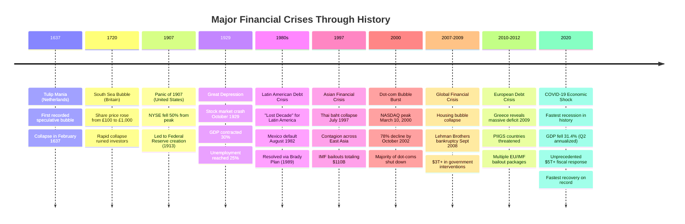

# Economic Crises and Systemic Resilience

## Introduction: The Eternal Dance of Boom and Bust

Financial crises are as old as finance itself—from the collapse of tulip speculation in 17th-century Amsterdam to the global financial meltdown of 2008. They represent moments when the architecture of economic confidence crumbles, revealing the fault lines in our financial systems. Yet each crisis also demonstrates remarkable human resilience: the capacity to learn, adapt, and rebuild stronger institutions.

This document examines the anatomy of financial crises, tracing patterns across centuries while acknowledging each disaster's unique character. We explore how leverage amplifies both prosperity and catastrophe, how panic spreads through interconnected systems, and how policymakers have evolved their responses from the laissez-faire approach of the 1930s to the massive interventions of 2020.

The central question is not whether crises will occur again—they will—but whether we can build systems resilient enough to withstand them without cascading into economic depression.

## Timeline of Major Financial Crises

## Part I: Theoretical Framework

### Hyman Minsky's Five Stages of Crisis

The late economist Hyman Minsky identified a recurring pattern in financial crises, detailed in his seminal work *Stabilizing an Unstable Economy* (1986). His framework reveals how periods of stability paradoxically breed instability—a concept now known as the "Minsky Moment."

#### The Five Stages:

**1. Displacement**
A displacement occurs when investors become enthused about a paradigm shift in the economy. This could be:
- Innovative technology (railroads, electricity, the internet, AI)
- Dramatic policy changes (low interest rates, deregulation)
- Discovery of new resources (oil, gold)
- Geopolitical shifts (end of Cold War, opening of China)

The displacement creates new profit opportunities that attract early investors who genuinely see value in the innovation.

**2. Boom**
Media attention and word-of-mouth create momentum. Lending expands as banks compete to finance the new opportunity. Asset prices related to the displacement begin rising faster than historical norms. More investors enter the market, driven by a fear of missing out (FOMO). Credit becomes easier to obtain, and leverage increases throughout the system.

**3. Euphoria**
This stage is characterized by:
- Asset prices decoupling from fundamental values
- Rationalization of "this time is different"
- New valuation metrics that justify extreme prices
- Retail investors entering en masse
- Credit standards deteriorating
- Fraud and corruption increasing

During euphoria, caution is dismissed as pessimism. Those warning of bubbles are marginalized as not understanding the "new paradigm."

**4. Profit-Taking**
Insiders and sophisticated investors begin selling to lock in gains. Early warning signs appear:
- Volume in the asset class peaks
- New investors find it harder to profit
- Some debtors struggle with loan payments
- Credit starts tightening
- Media sentiment shifts from universally bullish to mixed

This phase can last months or even years, with prices plateauing rather than crashing immediately.

**5. Panic (The Minsky Moment)**
Confidence evaporates rapidly:
- Selling accelerates as investors rush for exits
- Asset prices plummet
- Highly leveraged institutions face insolvency
- Credit markets freeze
- Contagion spreads to related sectors
- Government intervention becomes necessary

The Minsky Moment is the tipping point when debt accumulation can no longer be sustained through refinancing or asset appreciation. What follows is deleveraging, often brutal and indiscriminate.

### The Role of Leverage and Debt Cycles

Leverage magnifies both gains and losses. When asset prices rise, leverage appears to be "free money"—allowing investors to control larger positions with smaller capital. But leverage is a double-edged sword:

**Upside of Leverage (During Booms):**
- Amplified returns on investment
- Increased liquidity in markets
- Economic growth acceleration
- Higher asset valuations

**Downside of Leverage (During Busts):**
- Forced selling to meet margin calls
- Cascading defaults
- Fire sales depressing prices further
- Bank runs and credit freezes
- Economic contraction

Minsky identified three types of borrowers that emerge during credit cycles:

1. **Hedge borrowers**: Can repay both principal and interest from cash flows (stable)
2. **Speculative borrowers**: Can only pay interest, must refinance principal (vulnerable)
3. **Ponzi borrowers**: Cannot pay either, rely entirely on asset appreciation (unstable)

During booms, the financial system shifts from hedge-dominated to Ponzi-dominated financing. When asset prices stop rising, Ponzi borrowers default first, triggering panic.

### Contagion and Systemic Risk

Modern financial systems are deeply interconnected through:
- **Counterparty networks**: Banks lend to each other via interbank markets
- **Cross-holdings**: Financial institutions own each other's securities
- **Derivatives**: Complex instruments create hidden linkages
- **Psychological contagion**: Panic in one market spreads fear to others

This creates the "too interconnected to fail" problem. During the 2008 crisis, AIG's collapse threatened to trigger a cascade because so many institutions had purchased credit default swaps from them. The government intervened not because AIG was large, but because it was a critical node in the financial network.

### Behavioral Factors: Animal Spirits

John Maynard Keynes coined the term "animal spirits" to describe the psychological and emotional factors driving economic decisions. Modern behavioral economics, championed by Nobel laureates like Robert Shiller and George Akerlof, has formalized these insights:

**Key Behavioral Biases in Crises:**

1. **Herding**: Investors follow the crowd, assuming others have superior information
2. **Recency bias**: Recent trends are extrapolated indefinitely into the future
3. **Overconfidence**: Investors believe they can time markets or are smarter than others
4. **Loss aversion**: Fear of losses drives panic selling beyond rational assessment
5. **Availability heuristic**: Recent, vivid events dominate risk perception

Robert Shiller's concept of "irrational exuberance" (a phrase borrowed from Alan Greenspan's 1996 warning) describes markets driven by psychological momentum rather than fundamentals. His research on the 2008 crisis highlighted how narratives—stories about housing always going up—became self-reinforcing until reality intervened.

## Part II: Historical Case Studies

### Case Study 1: The Great Depression (1929-1939)

#### Background and Causes

The 1920s "Roaring Twenties" saw unprecedented prosperity in America. Stock prices tripled between 1924 and 1929. Margin trading allowed investors to buy stocks with just 10% down, creating massive leverage. On October 24, 1929 ("Black Thursday"), panic selling began. By October 29 ("Black Tuesday"), the market had lost $14 billion in value.

But the stock market crash alone didn't cause the Depression—policy failures turned a recession into catastrophe.

#### Critical Policy Mistakes

**1. The Gold Standard**
Economists like Barry Eichengreen and Ben Bernanke have established the "gold standard theory" as the consensus explanation for the Depression's severity and global spread. Under the gold standard:
- Countries that lost gold had to contract their money supply
- This caused deflation, making debts more burdensome
- Trade imbalances couldn't adjust through exchange rates
- Countries were forced into deflationary spirals

**2. Smoot-Hawley Tariff Act (1930)**
President Herbert Hoover signed this protectionist legislation despite warnings from 1,028 leading economists urging a veto. The act raised tariffs on over 20,000 imported goods. Trading partners retaliated with their own tariffs. World trade collapsed by 66% between 1929 and 1934, devastating the global economy.

While economists debate whether Smoot-Hawley caused the Depression or merely worsened it, there's consensus it was a catastrophic policy error that deepened and prolonged the crisis.

**3. Federal Reserve Passivity**
Milton Friedman and Anna Schwartz's *A Monetary History of the United States* argued the Fed's biggest mistake was inaction. Between 1930 and 1933:
- One-third of U.S. banks failed
- The money supply contracted 35%
- The Fed failed to inject liquidity or lower interest rates aggressively
- Banking system collapse was allowed to progress unchecked

By not acting as lender of last resort, the Fed transformed a normal recession into economic catastrophe.

#### Outcomes and Lessons

- **Duration**: The Depression lasted roughly a decade (1929-1939)
- **Peak unemployment**: 25% in the United States
- **GDP decline**: Approximately 30% from peak to trough
- **Recovery**: Came with World War II mobilization and massive government spending

**Key Lessons:**
1. Central banks must act as lenders of last resort during banking panics
2. Deflation is more dangerous than moderate inflation during debt crises
3. Protectionism in a crisis spreads contagion globally
4. The gold standard amplified rather than stabilized the crisis
5. Fiscal policy matters—the New Deal provided crucial relief even if not sufficient for full recovery

The Depression led to fundamental reforms: FDIC deposit insurance (1933), SEC regulation of securities (1934), and eventually abandonment of the gold standard (complete by 1971).

### Case Study 2: Asian Financial Crisis (1997-1998)

#### Origins in Thailand

Thailand experienced a massive boom in the 1990s, with significant capital inflows funding real estate speculation. The Thai baht was pegged at 25 to the U.S. dollar. By 1996, Thailand's current account deficit reached 8% of GDP—a dangerous warning sign.

In May 1997, speculators attacked the baht. Thailand spent its foreign exchange reserves defending the peg before capitulating on July 2, 1997, floating the currency. The baht collapsed, losing over 50% of its value within months.

#### Contagion Spreads

The crisis illustrated textbook financial contagion:
- **Indonesia**: Rupiah fell 80% in six months
- **South Korea**: Won declined nearly 50%
- **Malaysia**: Ringgit dropped 45%
- **Philippines, Hong Kong, Singapore**: All experienced severe market stress

Why did contagion spread so rapidly? Investors reassessed risk across all "emerging Asian tigers," assuming similar vulnerabilities:
- High foreign-currency debt
- Weak banking systems
- Asset bubbles (especially real estate)
- Fixed exchange rates vulnerable to speculative attack

#### IMF Intervention and Controversy

The IMF assembled bailout packages totaling approximately $110 billion for affected countries. However, IMF conditionality required:
- Fiscal austerity (spending cuts, tax increases)
- High interest rates to defend currencies
- Banking sector restructuring
- Market liberalization

**Criticism of the IMF Response:**
Many economists, particularly Joseph Stiglitz, argued the IMF's "one-size-fits-all" approach was inappropriate. The crisis was caused by private sector over-borrowing, not government fiscal profligacy. Imposing austerity during recession deepened the contraction unnecessarily.

The widely held perception that IMF prescriptions did more harm than good focused particular attention on reforming global financial governance.

#### Recovery and Aftermath

By 2001, most affected countries had recovered. Thailand repaid the IMF four years ahead of schedule in 2003. But the crisis left lasting changes:
- Countries built massive foreign exchange reserves as self-insurance
- Reduced reliance on short-term foreign borrowing
- More flexible exchange rate regimes
- Regional cooperation initiatives (Chiang Mai Initiative)

The crisis demonstrated that rapid capital flow reversals could devastate even fast-growing economies, spurring the development of "macroprudential" regulation to manage systemic risk.

### Case Study 3: Global Financial Crisis (2007-2009)

#### The Housing Bubble and Subprime Lending

The seeds of catastrophe were planted years before 2007. Between 2000 and 2006:
- U.S. housing prices doubled in many markets
- Subprime mortgage lending exploded from $30B (2003) to $225B (2006)
- Credit standards deteriorated (NINJA loans: No Income, No Job, No Assets)
- Adjustable-rate mortgages became common, often with teaser rates

Financial innovation created a web of complexity that obscured risk:

**Mortgage-Backed Securities (MBS)**
Banks bundled mortgages into securities and sold them to investors, removing risk from their own balance sheets—or so they thought.

**Collateralized Debt Obligations (CDOs)**
Investment banks sliced MBS into tranches with different risk levels. The global CDO market exploded from $300B (1997) to nearly $2T (2006).

**Synthetic CDOs**
These were essentially bets on whether other CDOs would default—creating multiple layers of exposure to the same underlying mortgages.

**Credit Default Swaps (CDS)**
Insurance against defaults, but unregulated and creating hidden interconnections. AIG alone sold hundreds of billions in CDS without adequate reserves.

#### The Collapse

The crisis unfolded in phases:

**Phase 1: Subprime Meltdown (Early 2007)**
Housing prices peaked in 2006 and began falling. Subprime borrowers, especially those with adjustable-rate mortgages, started defaulting in large numbers.

**Phase 2: Liquidity Crisis (Mid-2007)**
MBS and CDO values plummeted. Banks stopped lending to each other as counterparty risk soared. Bear Stearns hedge funds collapsed in July 2007.

**Phase 3: System-Wide Panic (September 2008)**
- **Sept 7**: Government seizes Fannie Mae and Freddie Mac
- **Sept 15**: Lehman Brothers files for bankruptcy
- **Sept 16**: Government rescues AIG with $85B (eventually $182B)
- **Sept 21**: Goldman Sachs and Morgan Stanley become bank holding companies, ending the investment banking era
- **Sept 29**: House rejects initial TARP bailout; Dow drops 777 points

The Lehman bankruptcy triggered global panic. Credit markets froze completely. The TED spread (difference between interbank lending rates and Treasury rates) spiked to unprecedented levels, indicating complete loss of confidence.

#### Policy Response

Unlike the 1930s, policymakers acted aggressively:

**Monetary Policy**
- Fed cut rates to zero (0-0.25% range)
- Quantitative easing: Fed purchased $600B in MBS and Treasuries initially, eventually expanding to over $3T in asset purchases
- New lending facilities to provide liquidity to markets

**Fiscal Policy**
- TARP (Troubled Asset Relief Program): $700B authorized to stabilize banks
- American Recovery and Reinvestment Act (2009): $787B stimulus package
- Auto industry bailouts
- Extended unemployment benefits

**International Coordination**
G20 countries coordinated unprecedented stimulus, preventing a global depression.

#### Outcomes

- **GDP decline**: U.S. GDP fell 4.3% from peak to trough
- **Unemployment**: Rose from 5% to 10%
- **Duration**: Recession officially lasted 18 months (Dec 2007 - June 2009)
- **Recovery**: Slow and uneven, taking years to return to pre-crisis employment

**Regulatory Response: Dodd-Frank and Basel III**

The crisis exposed catastrophic regulatory failures. The response included:

**Dodd-Frank Act (2010) - U.S.**
- Created Financial Stability Oversight Council (FSOC) for systemic risk monitoring
- Volcker Rule: Prohibited banks from proprietary trading
- Consumer Financial Protection Bureau (CFPB)
- Resolution authority for failing systemically important institutions
- Higher capital requirements for large banks
- Derivatives regulation and clearing requirements

**Basel III - International**
Reformed bank capital requirements globally:
- Increased capital quality and quantity requirements
- Tier 1 capital for largest U.S. banks rose from 8-9% (pre-crisis) to 12-14% (post-reform)
- New liquidity requirements (Liquidity Coverage Ratio, Net Stable Funding Ratio)
- Countercyclical capital buffers
- Leverage ratio requirements

**Effectiveness**
These reforms significantly strengthened the banking system. When COVID-19 struck in 2020, banks were far better capitalized and weathered the storm without failures, validating the post-2008 regulatory architecture.

### Case Study 4: COVID-19 Economic Shock (2020)

#### The Fastest Crisis

COVID-19 created an unprecedented economic shock—a crisis caused not by financial excess but by deliberate economic shutdown to contain a pandemic. The collapse was breathtaking:

- **GDP decline**: U.S. real GDP fell 31.4% annualized in Q2 2020
- **Unemployment**: Spiked from 3.5% (February) to 14.7% (April)
- **Duration**: Just two months (March-April), the shortest recession on record
- **Scope**: Global synchronized recession affecting all major economies

#### Policy Response: Lessons Learned

The response to COVID-19 was dramatically different from 2008, reflecting lessons learned from previous crises.

**Fiscal Policy - Massive and Immediate**
Congress authorized over $5 trillion in relief spending (combining 2020-2021 packages):

1. **CARES Act (March 2020)**: $2.2 trillion
   - $1,200 direct payments to individuals
   - $600/week supplemental unemployment benefits
   - Paycheck Protection Program (PPP) for businesses
   - Airline and industry-specific support

2. **Consolidated Appropriations Act (December 2020)**: $900 billion
   - Extended unemployment benefits
   - Additional direct payments

3. **American Rescue Plan (March 2021)**: $1.9 trillion
   - $1,400 direct payments
   - Extended unemployment support
   - State and local government aid
   - Vaccine distribution funding

This represented approximately 25% of GDP—unprecedented peacetime fiscal intervention.

**Monetary Policy - Even More Aggressive**

The Federal Reserve:
- Cut rates to zero immediately (March 15, 2020)
- Announced unlimited quantitative easing ("whatever it takes")
- Initially committed to $700B in asset purchases, ultimately exceeding $4T
- Expanded lending facilities beyond 2008 scope
- Backstopped corporate bond markets, municipal bonds, even junk bonds

**Unconventional Outcome: Income Rose During Recession**

Remarkably, personal income increased in Q2 2020—the opposite of normal recession patterns. Government transfers exceeded lost wage income. This "negative correlation" between GDP and income was unprecedented and demonstrates the power of aggressive fiscal intervention.

#### Results: The Fastest Recovery

By most measures, the recovery was extraordinarily rapid:
- **Labor market**: Returned to pre-pandemic unemployment by early 2022
- **GDP**: Exceeded pre-pandemic levels by Q2 2021
- **Corporate profits**: Reached record highs
- **Stock market**: Recovered within months, then hit new highs

**The Inflation Debate**

Success came with complications. By 2021-2022, inflation surged to 40-year highs (peaking above 9%). Debate raged over whether:
1. Stimulus was excessive, creating demand-pull inflation
2. Supply chain disruptions were the primary cause
3. Energy price shocks (exacerbated by Ukraine war) drove inflation

The consensus view suggests all three factors contributed, but policymakers generally defended the approach: better to overshoot on support and deal with inflation than risk depression through inadequate response.

#### Key Lessons from COVID-19

1. **Speed matters**: Rapid, massive intervention prevented depression
2. **Direct support works**: Putting money directly in people's hands sustained demand
3. **Institutional learning**: Policymakers applied 2008 lessons effectively
4. **Fiscal-monetary coordination**: Combined approach more powerful than either alone
5. **Inflation trade-off**: Aggressive stimulus may create inflation, but avoiding depression is worth it

The COVID crisis validated modern macroeconomic policy approaches while highlighting ongoing debates about appropriate intervention scale.

## Part III: Patterns, Prediction, and Prevention

### Common Patterns Across Crises

Despite unique triggers, financial crises share recurring features:

**1. Credit Boom Preceding Bust**
Nearly every major crisis follows a period of rapid credit expansion. Debt-to-GDP ratios surge during booms, creating vulnerability.

**2. Asset Price Bubbles**
Whether tulips, stocks, real estate, or dot-com companies, unsustainable asset appreciation precedes collapse.

**3. Financial Innovation Obscuring Risk**
New instruments—from South Sea Company shares to synthetic CDOs—create complexity that hides true exposure.

**4. Regulatory Arbitrage**
Financial institutions migrate activity to less-regulated sectors (shadow banking in 2008, cryptocurrency in 2020s).

**5. Dismissal of Warnings**
In every bubble, warnings are dismissed with "this time is different" reasoning.

**6. Contagion Beyond Fundamentals**
Crises spread to seemingly unrelated sectors through psychological and financial linkages.

**7. Policy Response Evolution**
Each crisis teaches lessons that inform the next response, generally leading to more aggressive intervention over time.

### Early Warning Indicators

Research on crisis prediction has identified several robust indicators:

**Financial Cycle Indicators**
- **Credit-to-GDP gap**: When credit growth significantly exceeds GDP growth (gap >5-8% of GDP)
- **Debt service ratio**: Rising proportion of income going to debt service
- **Asset price-to-income ratios**: Housing or equity prices decoupling from income/rent fundamentals

**Market-Based Indicators**
- **Equity price peaks**: Stock and property prices tend to peak before crises
- **TED spread**: Widening between interbank rates and Treasury rates signals stress
- **Credit default swap spreads**: Rising cost of default insurance

**Behavioral Indicators**
- **Investor sentiment extremes**: Surveys showing unusual optimism or pessimism
- **Media narrative shift**: Language analysis showing euphoric coverage
- **Retail investor participation**: Surge in small investor activity often signals late-stage bubble

**Network Analysis**
Modern research uses network modeling to identify:
- **Interconnectedness measures**: Density of financial linkages
- **Systemic importance**: Institutions serving as critical nodes
- **Contagion paths**: How shocks could propagate

**Limitations of Prediction**

Despite these indicators, precise crisis timing remains elusive:
- Markets can stay irrational longer than analysts expect
- Multiple indicators can flash warnings for years before crisis
- False positives are common (predicted crises that never occur)
- Policy interventions can delay or prevent crises, validating warnings retroactively

As economist Rudi Dornbusch noted: "The crisis takes a much longer time coming than you think, and then it happens much faster than you would have thought."

### Building Systemic Resilience

Rather than prediction, modern policy focuses on resilience—building systems that can withstand shocks:

**1. Macroprudential Regulation**
Monitor systemic risk, not just individual institution safety:
- Countercyclical capital buffers (increase requirements during booms)
- Stress testing under adverse scenarios
- Activity-based regulation (regulating activities, not just entities)

**2. Higher Capital Requirements**
Basel III and Dodd-Frank increased bank capital significantly, creating larger buffers to absorb losses.

**3. Resolution Mechanisms**
Orderly wind-down procedures for failing institutions:
- Living wills (plans for bankruptcy)
- Single-point-of-entry resolution
- Bail-in provisions (creditors, not taxpayers, take losses)

**4. Transparency and Disclosure**
Reducing hidden exposures:
- Central clearing for derivatives
- Reporting requirements for shadow banking
- Regular public stress test results

**5. Automatic Stabilizers**
Economic policies that activate automatically:
- Progressive taxation (automatically becomes less burdensome in recessions)
- Unemployment insurance
- Some proposals for automatic stimulus triggers

**6. Central Bank Toolkit Expansion**
Modern central banks have broader tools:
- Traditional interest rate policy
- Quantitative easing
- Forward guidance
- Sector-specific lending facilities
- Direct support for commercial paper, municipal bonds

### The Paradox of Stability

Minsky's most profound insight was the "stability is destabilizing" paradox:
- Long periods without crisis breed complacency
- Risk-taking increases when memories of disaster fade
- Safety mechanisms enable greater leverage
- Success in preventing small crises may enable larger ones

This suggests crisis prevention is partially self-defeating. Complete elimination of financial volatility may be impossible—and attempting it might increase ultimate fragility.

## Part IV: Current Vulnerabilities and Future Risks

### Known Vulnerabilities (2025)

**1. Sovereign Debt Levels**
Post-COVID debt levels are historically high:
- U.S. federal debt exceeds 120% of GDP
- Japan above 250% of GDP
- Many European countries above 100%

Low interest rates made this sustainable, but rising rates increase debt service costs significantly.

**2. Shadow Banking and Non-Bank Lenders**
Regulatory arbitrage continues:
- Private credit markets (private equity, direct lending)
- Fintech lenders outside traditional regulation
- Cryptocurrency and DeFi platforms

These sectors provide credit outside the regulated banking system, creating potential blind spots for regulators.

**3. Climate-Related Financial Risk**
Physical risks (extreme weather, sea-level rise) and transition risks (stranded fossil fuel assets) create new categories of systemic risk not fully priced by markets.

**4. Geopolitical Fragmentation**
Tensions between U.S. and China, Russia's isolation, potential for conflict over Taiwan—all create tail risks for global markets and supply chains.

**5. Cryptocurrency and Digital Assets**
While crypto markets remain small relative to traditional finance, increasing interconnections (institutional adoption, crypto lending, stablecoins) could create contagion channels.

**6. Commercial Real Estate**
Post-pandemic shift to remote work has depressed office building values. Banks with heavy CRE exposure face potential losses, particularly regional and community banks.

### The "This Time Is Different" Syndrome

Every generation believes it has transcended the limitations of the past. Carmen Reinhart and Kenneth Rogoff's book *This Time Is Different* documents eight centuries of financial folly driven by this conviction.

Current candidates for "this time is different" thinking:
- **Modern monetary theory**: Belief that currency-issuing governments need not worry about deficits
- **AI-driven productivity**: Faith that artificial intelligence will generate growth sufficient to service debts
- **Cryptocurrency**: Belief in decentralized finance as inherently more stable than traditional systems

History suggests skepticism is warranted. Human nature—greed, fear, herd behavior—remains constant across centuries.

### Reasons for Optimism

Despite persistent vulnerabilities, there are legitimate grounds for confidence:

**1. Institutional Learning**
The policy response to COVID-19 demonstrated that lessons from 1929 and 2008 have been internalized. Central banks and governments act faster and more aggressively.

**2. Stronger Banking System**
Post-2008 reforms have significantly strengthened bank capital and liquidity. When COVID struck, banks were part of the solution, not the problem.

**3. Better Monitoring**
Technology enables real-time monitoring of systemic risk. Financial Stability Oversight Council, European Systemic Risk Board, and similar bodies actively scan for vulnerabilities.

**4. International Coordination**
Despite geopolitical tensions, financial authorities maintain channels for coordination through BIS, IMF, and G20.

**5. Fiscal Space in Some Countries**
While debt is high, countries with strong institutions and reserve currencies (U.S., Germany, Japan) retain capacity for crisis response.

## Conclusion: Living with Instability

Financial crises are not anomalies to be eliminated, but rather inherent features of market economies. Leverage, innovation, and risk-taking drive economic growth—but also create fragility. The goal is not a crisis-free world, but resilient systems that can weather inevitable storms without cascading into depression.

The evolution from 1929's catastrophic policy failures to 2020's aggressive and effective interventions demonstrates real progress. We've learned that:

- **Central banks must act boldly** as lenders of last resort
- **Fiscal policy matters** in deep recessions when monetary policy is constrained
- **Prevention through regulation** is cheaper than crisis response
- **Speed of response** is critical—delay amplifies damage
- **International cooperation** prevents contagion

Yet hubris remains the greatest danger. Each success in crisis management creates confidence that we've mastered these forces. Each period of stability encourages risk-taking that plants seeds for the next crisis. Minsky's paradox endures.

The crises of the future will surprise us. New technologies, new forms of leverage, new interconnections will create vulnerabilities we don't yet recognize. Climate change adds a dimension of physical risk unprecedented in financial history. Geopolitical fragmentation threatens the international cooperation that has characterized crisis response since 2008.

Our best defense is humility: recognizing that markets are driven by human psychology, that innovation creates unintended consequences, that stability breeds complacency. Resilient systems aren't those that never fail, but those that fail safely—containing damage, learning from mistakes, and rebuilding stronger.

The eternal dance of boom and bust will continue. Our task is not to end the music, but to ensure that when the music stops, we have enough chairs for everyone.

---

## References and Further Reading

**Classic Works:**
- Minsky, Hyman. *Stabilizing an Unstable Economy* (1986)
- Kindleberger, Charles P. & Aliber, Robert Z. *Manias, Panics, and Crashes* (7th ed., 2011)
- Reinhart, Carmen M. & Rogoff, Kenneth S. *This Time Is Different: Eight Centuries of Financial Folly* (2009)
- Akerlof, George A. & Shiller, Robert J. *Animal Spirits: How Human Psychology Drives the Economy* (2009)

**The Great Depression:**
- Friedman, Milton & Schwartz, Anna J. *A Monetary History of the United States* (1963)
- Eichengreen, Barry. *Golden Fetters: The Gold Standard and the Great Depression* (1992)
- Bernanke, Ben S. *Essays on the Great Depression* (2000)

**The 2008 Crisis:**
- Financial Crisis Inquiry Commission. *The Financial Crisis Inquiry Report* (2011)
- Lewis, Michael. *The Big Short* (2010)
- Sorkin, Andrew Ross. *Too Big to Fail* (2009)
- Tooze, Adam. *Crashed: How a Decade of Financial Crises Changed the World* (2018)

**COVID-19 Economic Crisis:**
- "Monetary Policy and Fiscal Policy Responses to the COVID-19 Crisis," Federal Reserve Bank of St. Louis (2020)
- "Measuring the effectiveness of US monetary policy during the COVID‐19 recession," PMC (2021)

**Early Warning Systems:**
- "Financial Cycles – Early Warning Indicators of Banking Crises?" IMF Working Paper (2021)
- "Machine learning as an early warning system to predict financial crisis," ScienceDirect (2020)

**Behavioral Finance:**
- Shiller, Robert J. *Irrational Exuberance* (3rd ed., 2015)
- Kahneman, Daniel. *Thinking, Fast and Slow* (2011)

**Online Resources:**
- Federal Reserve History (federalreservehistory.org)
- BIS Papers and Working Papers (bis.org)
- IMF Working Papers (imf.org)
- NBER Working Papers (nber.org)

---

*Document created: November 19, 2025*
*Part of Economic History Quantitative Analysis Project*
*Word count: ~5,200*
