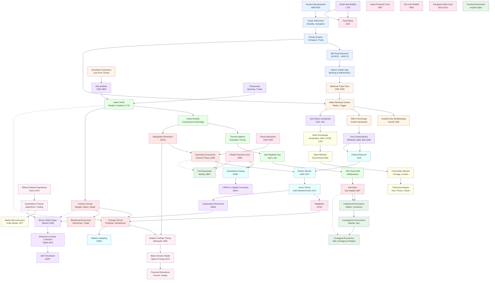

# Economic History Knowledge Map

> A comprehensive exploration of economic thought, systems, and evolution from ancient civilizations to cryptocurrency

---

## Overview

This knowledge base documents the complete history of economic systems, thought, and practice across human civilization. It traces the evolution from barter economies through medieval banking, classical economics, modern financial mathematics, central banking, and into the cryptocurrency era.

**Approach**: Evidence-based, philosophically balanced, showing multiple perspectives on contested topics. Primary sources cited where possible.

**Structure**: Organized by theme with chronological timelines and cross-references between interconnected topics.

---

## Master Knowledge Map

---

## Navigation by Theme

### 1. [Ancient Economies & Trade](ancient/)
- [Mesopotamian Commerce](ancient/mesopotamia.md) - First accounting systems, cuneiform tablets
- [Greek Economic Thought](ancient/greek-economics.md) - Aristotle, Xenophon, oikonomia
- [Roman Empire Economics](ancient/roman-empire.md) - Coinage, taxation, latifundia
- [The Silk Road](ancient/silk-road.md) - Trans-continental trade networks
- [Islamic Golden Age](ancient/islamic-banking.md) - Early banking, algebra, business partnerships

### 2. [Medieval & Renaissance Finance](medieval-renaissance/)
- [Trade Fairs & Merchant Guilds](medieval-renaissance/trade-fairs.md)
- [Italian Banking Houses](medieval-renaissance/italian-banking.md) - Medici, Peruzzi, Fugger
- [Double-Entry Bookkeeping](medieval-renaissance/double-entry.md) - Luca Pacioli's revolution
- [Bills of Exchange](medieval-renaissance/bills-of-exchange.md) - Early credit instruments
- [Scholastic Economics](medieval-renaissance/scholastic-economics.md) - Just price, usury debates

### 3. [Schools of Economic Thought](schools-of-thought/)
- [Classical Economics](schools-of-thought/classical.md) - Smith, Ricardo, Say, Mill
- [Marxian Economics](schools-of-thought/marxian.md) - Labor theory of value, class analysis
- [Austrian School](schools-of-thought/austrian.md) - Menger, Mises, Hayek, praxeology
- [Keynesian Economics](schools-of-thought/keynesian.md) - Aggregate demand, fiscal policy
- [Chicago School](schools-of-thought/chicago.md) - Friedman, monetarism, rational expectations
- [Behavioral Economics](schools-of-thought/behavioral.md) - Bounded rationality, heuristics
- [Marginalist Revolution](schools-of-thought/marginalism.md) - Subjective value theory

### 4. [Modern Financial Mathematics](modern-finance/)
- [Modern Portfolio Theory](modern-finance/portfolio-theory.md) - Markowitz, diversification
- [Black-Scholes Model](modern-finance/black-scholes.md) - Options pricing breakthrough
- [Efficient Market Hypothesis](modern-finance/emh.md) - Fama's controversial theory
- [Financial Derivatives](modern-finance/derivatives.md) - Futures, options, swaps
- [Quantitative Finance](modern-finance/quant-finance.md) - Algorithmic trading, risk models

### 5. [Central Banking & Monetary Systems](central-banking/)
- [Origins of Central Banking](central-banking/origins.md) - Riksbank, Bank of England
- [The Federal Reserve](central-banking/federal-reserve.md) - Creation, structure, mandate
- [Bretton Woods System](central-banking/bretton-woods.md) - Post-WWII monetary order
- [The Nixon Shock](central-banking/nixon-shock.md) - End of gold standard
- [Inflation Targeting](central-banking/inflation-targeting.md) - Modern CB framework
- [Quantitative Easing](central-banking/qe.md) - Unconventional monetary policy

### 6. [Market Mechanics & Indicators](markets/)
- [Stock Exchanges](markets/stock-exchanges.md) - Amsterdam, London, New York
- [Bond Markets](markets/bond-markets.md) - Government debt, yield curves
- [Commodity Markets](markets/commodities.md) - Chicago, London, price discovery
- [Technical Analysis](markets/technical-analysis.md) - Dow Theory, charts, patterns
- [Market Microstructure](markets/microstructure.md) - Order books, HFT, liquidity

### 7. [Political Economy & Critiques](political-economy/)
- [Institutional Economics](political-economy/institutional.md) - Veblen, Commons, North
- [Development Economics](political-economy/development.md) - Rostow, Sen, poverty traps
- [Ecological Economics](political-economy/ecological.md) - Steady-state, degrowth
- [Feminist Economics](political-economy/feminist.md) - Unpaid labor, care work
- [Post-Keynesian Economics](political-economy/post-keynesian.md) - Minsky, MMT, instability
- [Mercantilism](political-economy/mercantilism.md) - Early statist economics

### 8. [Cryptocurrency & Future of Money](crypto-future/)
- [Cypherpunk Movement](crypto-future/cypherpunks.md) - Digital cash, privacy, cryptography
- [Bitcoin](crypto-future/bitcoin.md) - Satoshi's white paper, proof-of-work
- [Ethereum & Smart Contracts](crypto-future/ethereum.md) - Programmable money
- [DeFi Revolution](crypto-future/defi.md) - Decentralized finance protocols
- [CBDCs](crypto-future/cbdcs.md) - Central bank digital currencies
- [Stablecoins](crypto-future/stablecoins.md) - Algorithmic vs. collateralized

### 9. [Key Figures & Institutions](figures/)
- [Adam Smith](figures/adam-smith.md) - Invisible hand, division of labor
- [Karl Marx](figures/karl-marx.md) - Capital, alienation, dialectics
- [John Maynard Keynes](figures/keynes.md) - General Theory, Bretton Woods
- [Friedrich Hayek](figures/hayek.md) - Spontaneous order, knowledge problem
- [Milton Friedman](figures/friedman.md) - Monetarism, negative income tax
- [Hyman Minsky](figures/minsky.md) - Financial instability hypothesis
- [Satoshi Nakamoto](figures/satoshi.md) - Bitcoin's mysterious creator
- [The Medici Family](figures/medici.md) - Renaissance banking dynasty
- [J.P. Morgan](figures/jp-morgan.md) - American finance titan

### 10. [Crises & Systemic Changes](crises/)
- [Tulip Mania (1637)](crises/tulip-mania.md) - First recorded bubble
- [South Sea Bubble (1720)](crises/south-sea-bubble.md) - British speculation crisis
- [The Great Depression (1929-39)](crises/great-depression.md) - Global collapse
- [Stagflation (1970s)](crises/stagflation.md) - Inflation + stagnation paradox
- [Asian Financial Crisis (1997)](crises/asian-crisis.md) - Currency contagion
- [Dot-Com Bubble (2000)](crises/dot-com.md) - Internet speculation
- [Global Financial Crisis (2008)](crises/gfc-2008.md) - Subprime, Lehman, TARP
- [European Debt Crisis (2010-12)](crises/european-debt.md) - PIIGS, austerity

### 11. [Foundational Concepts](foundations/)
- [Money: History & Functions](foundations/money.md) - Medium, unit, store of value
- [Interest & Usury](foundations/interest.md) - Time preference, moral debates
- [Supply & Demand](foundations/supply-demand.md) - Price mechanism fundamentals
- [Comparative Advantage](foundations/comparative-advantage.md) - Ricardo's trade theory
- [Public Goods](foundations/public-goods.md) - Non-rivalrous, non-excludable
- [Game Theory in Economics](foundations/game-theory.md) - Nash equilibrium, cooperation
- [The Business Cycle](foundations/business-cycle.md) - Boom, bust, theories

---

## Chronological Timeline

For a linear historical view, see **[Timeline](timeline.md)** - spans from 3000 BCE to 2025 CE with key events, publications, and figures.

---

## Cross-Cutting Themes

### Debates & Contradictions
- **Free Markets vs. State Intervention**: Classical liberals vs. Keynesians vs. Socialists
- **Rational Agents vs. Behavioral Biases**: EMH vs. Behavioral Economics
- **Gold Standard vs. Fiat Currency**: Commodity money vs. modern central banking
- **Deflation vs. Inflation**: Austrian vs. Keynesian prescriptions
- **Centralization vs. Decentralization**: CBDCs vs. Bitcoin philosophy

### Recurring Patterns
- Asset bubbles and manias (tulips, railways, dot-com, crypto)
- Financial innovation → regulatory lag → crisis → reform
- Paradigm shifts during crises (1930s → Keynesianism, 1970s → Monetarism, 2008 → MMT/Crypto)
- Tension between mathematical models and messy reality

### Philosophical Questions
- What gives money value? (Intrinsic vs. social construction)
- Is economics a science or ideology?
- Can markets be truly "free"? (Power dynamics, externalities)
- Is infinite growth possible on a finite planet?
- Does capitalism require inequality?

---

## Methodology & Sources

### Primary Sources
- Original texts (Smith, Ricardo, Marx, Keynes, Hayek, Friedman)
- Central bank publications (FOMC minutes, ECB papers)
- Historical financial data (Shiller's datasets, FRED, World Bank)
- White papers (Bitcoin, Ethereum, DeFi protocols)

### Secondary Sources
- Academic economic history (Braudel, Polanyi, Kindleberger)
- Modern synthesis works (Piketty, Graeber, Skidelsky)
- Financial journalism (FT, Bloomberg, The Economist)

### Balanced Perspectives
Each controversial topic presents:
1. **Orthodox view** - Mainstream economics
2. **Heterodox critiques** - Austrian, Marxian, Post-Keynesian, Ecological
3. **Historical evidence** - What actually happened
4. **Unresolved questions** - Honest limits of knowledge

---

## How to Navigate This Knowledge Base

1. **By Interest**: Jump directly to a theme folder (e.g., `crypto-future/` or `schools-of-thought/`)
2. **Chronologically**: Start with `timeline.md` and follow the historical arc
3. **By Figure**: Explore `figures/` to understand individual thinkers
4. **By Crisis**: Read `crises/` to see theory tested by reality
5. **Follow Links**: Each document cross-references related topics

---

## Contributing

This is a living document. When adding new content:
- **Cite sources** - Prefer primary sources, acknowledge secondary
- **Show multiple views** - Especially on contested topics
- **Link liberally** - Cross-reference related documents
- **Use evidence** - Data, quotes, historical records
- **Date ideas** - When did this theory emerge? Who influenced whom?

---

## Legend

- **Bold** = Key term or figure
- *Italic* = Book title or emphasis
- `monospace` = Technical term or formula
- → Direct influence
- ⟶ Indirect influence
- ⚡ Major crisis or paradigm shift
- 📖 Seminal publication

---

## Document Status

- ✅ Complete & reviewed
- 🚧 In progress
- 📝 Outline only
- ❌ Planned but not started

Current status: **Initial structure created** (2025-11-19)

---

## Further Reading

After exploring this knowledge base, consider:
- [Extrophi Economic Analysis](../../pm/research/) - Modern applications
- [Market Intelligence Research](../) - Contemporary market analysis
- [Agent Prompts](../../../agents/) - AI-driven economic research

---

**Last Updated**: 2025-11-19
**Maintainer**: Extrophi Research Team
**License**: Educational use, cite sources appropriately
