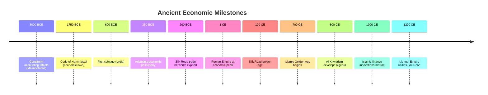

# Ancient Economies & Trade Routes

> From temple accounting to trans-continental commerce - the foundations of economic systems

Before Adam Smith, before money as we know it, before corporations and stock markets, human societies developed sophisticated economic systems. This directory explores the origins of trade, currency, credit, and economic thought in ancient civilizations.

---

## Document Index

### [Mesopotamian Commerce (3000-500 BCE)](mesopotamia.md)
**Status**: 📝 Outline needed

**First in Human History**:
- Cuneiform accounting tablets (3000 BCE) - oldest written economic records
- Temple and palace redistribution systems
- Silver as unit of account (shekel = weight measure)
- Interest-bearing loans documented
- Code of Hammurabi (1750 BCE): Property rights, debt, wages

**Key Concepts**:
- **Redistribution economy**: Temples collect surplus, redistribute rations
- **Market economy emerges**: Private merchants (tamkarum) alongside state system
- **Credit instruments**: Debt tablets, promissory notes

**Evidence**: 500,000+ cuneiform tablets excavated

**Cross-references**: [Money](../foundations/money.md), [Interest & Usury](../foundations/interest.md)

---

### [Greek Economic Thought (800-300 BCE)](greek-economics.md)
**Status**: 📝 Outline needed

**Key Thinkers**:

**Xenophon (430-354 BCE)**:
- *Oeconomicus*: Household management treatise
- "Oikonomia" = household law (oikos + nomos)

**Aristotle (384-322 BCE)**:
- *Politics* & *Nicomachean Ethics*
- Distinguishes:
  - **Oikonomia**: Natural household management
  - **Chrematistics**: Unnatural wealth accumulation
- Condemns usury (money breeding money)
- "Barren" nature of money
- Just price concept

**Economic Institutions**:
- Coinage spreads (7th century BCE)
- Maritime trade, banking (trapezitai)
- Slave economy foundation
- Land ownership restrictions (citizens only)

**Legacy**: Influenced medieval scholastic economics, modern critiques of financialization

**Cross-references**: [Scholastic Economics](../medieval-renaissance/scholastic-economics.md), [Interest & Usury](../foundations/interest.md)

---

### [Roman Empire Economics (27 BCE - 476 CE)](roman-empire.md)
**Status**: 📝 Outline needed

**Monetary System**:
- **Denarius** silver coin (standard for 400+ years)
- **Aureus** gold coin
- Currency debasement → inflation (3rd century crisis)
- Diocletian's price controls (301 CE) - fail

**Economic Institutions**:
- **Publicani**: Tax farming corporations
- **Latifundia**: Large slave-run estates
- **Collegia**: Trade guilds
- **Annona**: State grain distribution (bread & circuses)

**Trade Networks**:
- Mediterranean Sea = "Roman Lake"
- Roads enable continental trade
- Trade with India (spices), China (silk via intermediaries)
- Gold drain to East for luxuries

**Decline Factors** (debated):
- Currency debasement
- Tax burden on peasantry
- Slave economy → innovation stagnation?
- Lead poisoning? (pipes, wine)

**Cross-references**: [Silk Road](silk-road.md), [Money](../foundations/money.md), [Medieval Trade](../medieval-renaissance/)

---

### [The Silk Road (100 BCE - 1400 CE)](silk-road.md)
**Status**: 📝 Outline needed

**Geography**: Chang'an (China) → Central Asia → Persia → Mediterranean

**Traded Goods**:
- **East to West**: Silk, porcelain, tea, spices, gunpowder
- **West to East**: Gold, silver, glass, wool, horses
- Ideas, religions, technologies also spread (Buddhism, paper, printing)

**Economic Impact**:
- Price arbitrage: Silk worth weight in gold in Rome
- Intermediary trading cities prosper (Samarkand, Bukhara)
- Bills of exchange develop for long-distance trade
- Risk management: Caravans, partnerships

**Decline**:
- Mongol Empire collapse (1368)
- Ottoman control limits European access → motivates Age of Exploration
- Sea routes (Indian Ocean, later Atlantic) replace overland

**Cross-references**: [Roman Empire](roman-empire.md), [Islamic Banking](islamic-banking.md), [Medieval Trade Fairs](../medieval-renaissance/trade-fairs.md)

---

### [Islamic Golden Age Finance (700-1300)](islamic-banking.md)
**Status**: 📝 Outline needed

**Prohibition of Riba (Usury)**:
- Quran forbids interest on loans
- But trade and profit-sharing encouraged
- Creative workarounds develop

**Islamic Financial Innovations**:

1. **Mudaraba** (Trust financing):
   - Silent partnership: Investor provides capital, entrepreneur provides labor
   - Profits shared, losses borne by investor (if entrepreneur not negligent)

2. **Musharaka** (Joint venture):
   - Both parties contribute capital and labor
   - Profits/losses shared proportionally

3. **Hawala** (Trust-based transfer):
   - Money transfer without physical movement
   - Network of brokers settle debts
   - Still used today (also by criminals - no audit trail)

4. **Sukuk** (Islamic bonds):
   - Asset-backed certificates (not debt)
   - Modern version: $140+ billion market

**Mathematical Contributions**:
- **Al-Khwarizmi** (780-850): Algebra (from Arabic "al-jabr")
- Decimal system, algorithms (from his name)
- Essential for financial calculations

**Trade Networks**:
- Connected China, India, East Africa, Spain
- Gold from West Africa (Mali Empire)
- Spices from Indonesia

**Legacy**: Modern Islamic finance ($2 trillion industry); influence on medieval European banking

**Cross-references**: [Interest & Usury](../foundations/interest.md), [Medieval Banking](../medieval-renaissance/italian-banking.md), [Bills of Exchange](../medieval-renaissance/bills-of-exchange.md)

---

## Cross-Cutting Themes

### Evolution of Money
1. **Barter** (mythical? Little historical evidence)
2. **Commodity money**: Grain, cattle, shells (still some barter)
3. **Metal by weight**: Silver, gold, copper
4. **Coinage**: Standardized, state-guaranteed (Lydia, 600 BCE)
5. **Credit instruments**: Debt tablets, bills of exchange

### Forms of Economic Organization

| System | Example | Mechanism | Strengths | Weaknesses |
|--------|---------|-----------|-----------|------------|
| **Reciprocity** | Gift economy | Social obligation | Social cohesion | Limited scale |
| **Redistribution** | Temple economy | Central collection + distribution | Risk-pooling | Bureaucratic overhead |
| **Market exchange** | Greek agora | Price mechanism | Efficiency, specialization | Inequality, instability |

(Karl Polanyi's typology)

### Role of the State
- **Mesopotamia**: Temple-palace central, markets secondary
- **Greece**: City-state regulation, but market-oriented
- **Rome**: State provides infrastructure, stability; relatively free markets
- **Islamic world**: Legal framework (sharia) shapes finance; trade encouraged

### Moral Debates on Commerce
- **Aristotle**: Money-making from exchange is "unnatural"
- **Cicero**: Trade acceptable if wholesale, not retail (class snobbery)
- **Quran**: Trade blessed, usury forbidden
- **Tension**: Commerce necessary but morally suspect (persists into Middle Ages)

---

## Why Ancient Economics Matters

### For Understanding Modern Systems
- **Debt crises**: Ancient debt jubilees vs. modern bankruptcy
- **Currency debates**: Commodity (gold) vs. fiat (state decree) → ancient precedents
- **Financial innovation**: Bills of exchange, partnerships, risk-sharing → modern derivatives
- **Moral questions**: Usury debates → payday lending, student debt

### Historical Patterns
- States that debase currency → inflation → collapse (Rome, China)
- Trade networks → prosperity but also vulnerability (Silk Road cities)
- Credit expansion → bubbles (real estate speculation in Roman Egypt)

### Alternative Models
- **Islamic finance**: Profit-sharing, not interest → relevant to ethical banking
- **Gift economies**: Reciprocity, not calculation → critique of market totalitarianism
- **Temple redistribution**: Safety nets, risk-pooling → welfare state precursors

---

## Timeline Snapshot

---

## Research Questions

1. **Primitive accumulation**: How did early states extract surplus to build monuments, armies?
2. **Slavery and innovation**: Did reliance on slave labor reduce incentives for technological progress?
3. **Women's economic roles**: How did gender shape production, trade, inheritance? (Often erased from records)
4. **Ecological limits**: Did ancient civilizations collapse from resource depletion? (Mesopotamian salinization, Roman deforestation)
5. **Comparative development**: Why did some regions develop complex economies earlier than others?

---

## Debates

### Formalist vs. Substantivist
- **Formalist** (neoclassical): Rational choice, supply/demand apply to all societies
- **Substantivist** (Polanyi): Ancient economies "embedded" in social relations, not autonomous markets
- **Evidence**: Both market and non-market mechanisms coexisted

### Slavery's Economic Impact
- **Marxist**: Slave mode of production limited technological innovation
- **Counter**: Roman engineering advanced despite slavery; slavery provided capital accumulation
- **Unresolved**: Counterfactual history impossible to test

### Causes of Roman Decline
- Economic (currency debasement, taxation)
- Military (barbarian invasions)
- Political (corruption, instability)
- Environmental (climate change, disease)
- Likely: Multiple interacting factors

---

## Further Reading

### Primary Sources
- **Code of Hammurabi** (translated)
- **Aristotle**: *Politics* (Book 1), *Nicomachean Ethics* (Book 5)
- **Xenophon**: *Oeconomicus*

### Secondary Sources
- **Morris Silver**: *Economic Structures of Antiquity*
- **Karl Polanyi**: *The Great Transformation* (on ancient economies)
- **Peter Temin**: *The Roman Market Economy*
- **Michael Hudson**: *...and forgive them their debts* (debt jubilees)

### Accessible Overviews
- **Jared Diamond**: *Guns, Germs, and Steel* (comparative development)
- **David Graeber**: *Debt: The First 5,000 Years* (anthropological perspective)

---

**Last Updated**: 2025-11-19
**Status**: Framework created, individual documents needed
**Perspective**: Ancient societies were sophisticated; modern finance has deep historical roots
