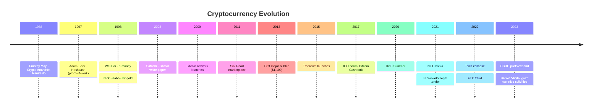

# Cryptocurrency & The Future of Money

> From cypherpunk ideals to decentralized finance - reimagining money for the digital age

This directory explores the cryptocurrency revolution, its philosophical roots, technical innovations, and potential futures. Born from the 2008 financial crisis, crypto represents both a technological breakthrough and an ideological challenge to centralized financial power.

---

## Document Index

### [Cypherpunk Movement (1980s-1990s)](cypherpunks.md)
**Status**: 📝 Outline needed

**Key Figures**: Timothy May, Eric Hughes, Wei Dai, Nick Szabo, Hal Finney, Adam Back

**Philosophical Foundations**:
- Cryptography as tool for individual liberty
- Privacy as fundamental right
- Distrust of government surveillance and monetary control
- "Code is law" - mathematics over institutions

**Precursors to Bitcoin**:
- **DigiCash** (David Chaum, 1989): Blind signatures for digital cash
- **Hashcash** (Adam Back, 1997): Proof-of-work for email spam prevention
- **b-money** (Wei Dai, 1998): Decentralized digital currency proposal
- **Bit gold** (Nick Szabo, 1998): Unforgeable digital scarcity

**Cross-references**: [Bitcoin](bitcoin.md), [Satoshi Nakamoto](../figures/satoshi.md), [Austrian School](../schools-of-thought/austrian.md)

---

### [Bitcoin (2008-Present)](bitcoin.md)
**Status**: 📝 Outline needed

**Genesis**: Satoshi Nakamoto's white paper (Oct 31, 2008), network launch (Jan 3, 2009)

**Technical Innovation**:
- Blockchain: Distributed ledger secured by proof-of-work
- Solves double-spend problem without trusted third party
- 21 million coin hard cap (programmed scarcity)
- Decentralized consensus (Nakamoto consensus)

**Economic Properties**:
- Deflationary by design (Austrian influence)
- Borderless, permissionless, censorship-resistant
- "Digital gold" narrative

**Evolution**:
- 2009-2012: Cypherpunk experiment, Silk Road usage
- 2013: First major price surge ($1,100)
- 2017: Scaling debate, Bitcoin Cash fork
- 2021: El Salvador legal tender, institutional adoption
- 2022-2023: Crypto winter, regulatory scrutiny

**Critiques**:
- Energy consumption (proof-of-work)
- Price volatility (not useful as currency)
- Scalability limitations (7 transactions/second)
- Use in illicit activity

**Cross-references**: [Satoshi Nakamoto](../figures/satoshi.md), [Austrian School](../schools-of-thought/austrian.md), [Nixon Shock](../central-banking/nixon-shock.md)

---

### [Ethereum & Smart Contracts (2015-Present)](ethereum.md)
**Status**: 📝 Outline needed

**Creator**: Vitalik Buterin (Russian-Canadian programmer, b. 1994)

**Innovation**: Turing-complete blockchain - programmable money

**Smart Contracts**:
- Self-executing code on blockchain
- "Vending machine" model: deposit X, get Y automatically
- No intermediaries needed for enforcement

**Use Cases**:
- Decentralized finance (DeFi)
- Non-fungible tokens (NFTs)
- Decentralized autonomous organizations (DAOs)
- Stablecoins (USDC, DAI)

**Evolution**:
- 2016: The DAO hack → Ethereum/Ethereum Classic split
- 2020: DeFi Summer explosion
- 2022: Merge to Proof-of-Stake (99% energy reduction)

**Philosophical Difference from Bitcoin**:
- Bitcoin: "Digital gold", store of value, simple script language
- Ethereum: "World computer", platform for decentralized applications

**Cross-references**: [DeFi Revolution](defi.md), [Stablecoins](stablecoins.md)

---

### [DeFi Revolution (2020-Present)](defi.md)
**Status**: 📝 Outline needed

**What is DeFi?** Decentralized Finance - recreating traditional financial services (lending, trading, derivatives) without intermediaries using smart contracts.

**Key Protocols**:
- **Uniswap**: Automated market maker (AMM), decentralized exchange
- **Aave**: Lending/borrowing protocol
- **MakerDAO**: DAI stablecoin, over-collateralized
- **Compound**: Interest rate protocol
- **Yearn Finance**: Yield aggregator
- **Curve**: Stablecoin swaps, low slippage

**Innovations**:
- Liquidity pools replace order books
- Yield farming: earn rewards for providing liquidity
- Flash loans: Uncollateralized loans within single transaction
- Composability: "Money Legos" - protocols interoperate

**DeFi Summer 2020**:
- Total Value Locked (TVL) grows from $1B to $100B+
- Speculation, innovation, and scams proliferate

**Critiques & Failures**:
- Smart contract bugs → hacks (The DAO, Poly Network, Wormhole)
- High transaction fees (Ethereum gas)
- Complexity → user error (lost funds)
- Regulatory uncertainty
- 2022 collapses: Terra/LUNA, Celsius, FTX

**Cross-references**: [Ethereum](ethereum.md), [Stablecoins](stablecoins.md), [Global Financial Crisis](../crises/gfc-2008.md) (comparison)

---

### [Stablecoins](stablecoins.md)
**Status**: 📝 Outline needed

**Problem**: Cryptocurrency volatility makes it unusable for daily transactions

**Solution**: Stablecoins pegged to fiat (usually $1 USD)

**Types**:

1. **Fiat-Collateralized** (reserves held by company)
   - USDT (Tether): Largest, controversial reserves
   - USDC (Circle): Transparent, regulated
   - BUSD (Binance/Paxos): Ended 2023

2. **Crypto-Collateralized** (over-collateralized with crypto)
   - DAI (MakerDAO): Decentralized, backed by ETH/other assets
   - Requires >100% collateral to absorb volatility

3. **Algorithmic** (no collateral, algorithmic supply adjustment)
   - UST (Terra): Spectacular collapse May 2022 → $60B evaporated
   - AMPL, FEI, FRAX (various mechanisms)

**Use Cases**:
- Trading (avoid converting to fiat)
- DeFi lending/borrowing
- Cross-border payments
- Dollarization in unstable economies

**Regulatory Concerns**:
- Reserves transparency (Tether skepticism)
- Systemic risk (bank runs)
- Money laundering, sanctions evasion

**Cross-references**: [DeFi](defi.md), [CBDCs](cbdcs.md), [Money](../foundations/money.md)

---

### [Central Bank Digital Currencies (CBDCs)](cbdcs.md)
**Status**: 📝 Outline needed

**What are CBDCs?** Digital versions of national fiat currencies, issued and controlled by central banks.

**Motivation**:
- Compete with private cryptocurrencies
- Modernize payment systems
- Financial inclusion
- Combat tax evasion, money laundering
- Maintain monetary sovereignty

**Implementation Status**:
- **China**: Digital Yuan (e-CNY) in pilot since 2020, most advanced
- **Europe**: Digital Euro research phase, launch ~2025-2028
- **USA**: "Digital dollar" research, political resistance
- **Bahamas**: Sand Dollar (first live CBDC, 2020)
- **Nigeria**: eNaira (launched 2021, slow adoption)

**Design Choices**:
- Retail (public access) vs. wholesale (banks only)
- Account-based vs. token-based
- Centralized vs. distributed ledger
- Programmability: Can money have built-in rules? (expire, geofenced)

**Concerns**:
- **Surveillance**: Government can track every transaction
- **Monetary policy**: Direct control over spending (helicopter money, negative rates)
- **Banking disintermediation**: Why use commercial banks if central bank offers accounts?
- **Cybersecurity**: Single point of failure
- **Civil liberties**: Programmable money could restrict freedom

**Philosophical Contrast with Bitcoin**:
- Bitcoin: Decentralized, permissionless, privacy-focused
- CBDCs: Centralized, permissioned, surveillance-friendly

**Cross-references**: [Quantitative Easing](../central-banking/qe.md), [Bitcoin](bitcoin.md), [Stablecoins](stablecoins.md)

---

## Thematic Connections

### Austrian Economics → Bitcoin
- **Friedrich Hayek**: Advocated for denationalization of money (1976)
- **Ludwig von Mises**: Regression theorem, sound money
- Bitcoin's fixed supply reflects Austrian distrust of fiat inflation

### 2008 Crisis → Crypto
- Genesis block: "Chancellor on brink of second bailout for banks"
- Reaction to quantitative easing, bank bailouts, centralized failure
- See: [Global Financial Crisis](../crises/gfc-2008.md), [Quantitative Easing](../central-banking/qe.md)

### Code as Law vs. Law as Code
- **Smart contracts**: Rules enforced by mathematics
- **CBDCs**: Law encoded into programmable money
- Different visions of technology's role in governance

---

## Timeline Snapshot

---

## Future Scenarios

### Scenario 1: Crypto as Alternative System
- Bitcoin becomes global reserve asset
- DeFi replaces traditional finance for tech-savvy
- Parallel economy emerges

### Scenario 2: CBDC Dominance
- Governments outlaw/regulate crypto heavily
- CBDCs become primary payment method
- Cash phased out, programmable money era

### Scenario 3: Coexistence
- Crypto for certain use cases (cross-border, savings)
- CBDCs for retail payments
- Traditional banking continues
- Regulatory clarity enables institutional adoption

### Scenario 4: Collapse
- Regulatory crackdown succeeds
- Energy concerns kill proof-of-work
- Smart contract hacks erode trust
- Crypto relegated to niche

---

## Research Questions

1. Can decentralized systems scale to Visa-level transaction throughput?
2. Is "code as law" compatible with human-centric justice systems?
3. Will CBDCs enable authoritarian monetary control or improve financial access?
4. Can algorithmic stablecoins ever be truly stable?
5. Is Bitcoin's energy usage justified by its decentralization benefits?
6. Will quantum computing break current cryptographic assumptions?

---

## Reading List

**Philosophical**:
- Timothy May: *The Crypto Anarchist Manifesto*
- Eric Hughes: *A Cypherpunk's Manifesto*
- Nick Szabo: *Shelling Out: The Origins of Money*

**Technical**:
- Satoshi Nakamoto: *Bitcoin: A Peer-to-Peer Electronic Cash System*
- Vitalik Buterin: *Ethereum White Paper*
- Andreas Antonopoulos: *Mastering Bitcoin*

**Critical**:
- David Golumbia: *The Politics of Bitcoin*
- Nicholas Weaver: Crypto skeptic talks
- Molly White: *Web3 is Going Just Great* blog

**Economic**:
- Saifedean Ammous: *The Bitcoin Standard* (Austrian perspective)
- Eswar Prasad: *The Future of Money*

---

**Last Updated**: 2025-11-19
**Status**: Framework created, individual documents needed
**Perspective**: Balanced view of both revolutionary potential and legitimate criticisms
