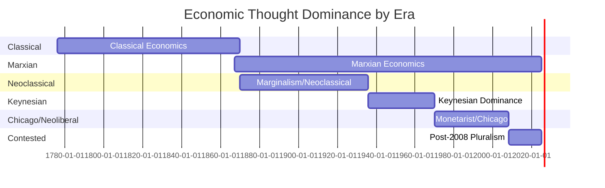

# Schools of Economic Thought

> Competing paradigms for understanding how economies function

Economics is not a unified science but a contested field with multiple schools offering fundamentally different explanations of the same phenomena. This directory maps the major intellectual traditions.

---

## Major Schools (Chronological)

### [Classical Economics (1776-1870)](classical.md)
**Status**: 📝 Outline needed

**Key Figures**: Adam Smith, David Ricardo, Jean-Baptiste Say, Thomas Malthus, John Stuart Mill

**Core Ideas**:
- Labor theory of value
- Say's Law (supply creates demand)
- Free markets and comparative advantage
- Self-regulating economy
- "Invisible hand" metaphor

**Legacy**: Foundation for all subsequent economics; influenced both neoclassical and Marxian traditions

**Cross-references**: [Adam Smith](../figures/adam-smith.md), [David Ricardo](../figures/ricardo.md), [Comparative Advantage](../foundations/comparative-advantage.md)

---

### [Marxian Economics (1867-Present)](marxian.md)
**Status**: 📝 Outline needed

**Key Figures**: Karl Marx, Friedrich Engels, Rosa Luxemburg, Paul Sweezy, David Harvey

**Core Ideas**:
- Labor theory of value + surplus value extraction
- Class conflict (bourgeoisie vs. proletariat)
- Historical materialism (economic base determines superstructure)
- Tendency of profit rate to fall
- Capitalism as inherently unstable and exploitative

**Modern Variants**: Analytical Marxism, Autonomist Marxism, world-systems theory

**Cross-references**: [Karl Marx](../figures/karl-marx.md), [Institutional Economics](../political-economy/institutional.md), [Ecological Economics](../political-economy/ecological.md)

---

### [Marginalist Revolution (1870s)](marginalism.md)
**Status**: 📝 Outline needed

**Key Figures**: Carl Menger, William Stanley Jevons, Léon Walras

**Core Breakthrough**:
- Shift from **labor theory of value** to **subjective marginal utility**
- Mathematical formalization of economics
- Resolved "diamond-water paradox"

**Impact**: Launched neoclassical economics, Austrian school; made economics more "scientific"

**Cross-references**: [Austrian School](austrian.md), [Classical Economics](classical.md)

---

### [Austrian School (1871-Present)](austrian.md)
**Status**: 📝 Outline needed

**Key Figures**: Carl Menger, Eugen von Böhm-Bawerk, Ludwig von Mises, Friedrich Hayek, Murray Rothbard

**Core Ideas**:
- Praxeology (deductive study of human action)
- Subjective value theory
- Knowledge problem (Hayek): centralized planning can't aggregate dispersed knowledge
- Austrian Business Cycle Theory: credit expansion → malinvestment → bust
- Radical free-market advocacy

**Methodology**: Rejects empiricism and mathematical modeling; uses logical deduction

**Modern Influence**: Libertarianism, Bitcoin philosophy, critique of central banking

**Cross-references**: [Friedrich Hayek](../figures/hayek.md), [Bitcoin](../crypto-future/bitcoin.md), [Central Banking](../central-banking/), [Business Cycle](../foundations/business-cycle.md)

---

### [Keynesian Economics (1936-Present)](keynesian.md)
**Status**: 📝 Outline needed

**Key Figures**: John Maynard Keynes, Paul Samuelson, John Hicks, James Tobin

**Core Ideas**:
- Aggregate demand determines output (rejects Say's Law)
- Market economies can get stuck in underemployment equilibrium
- Active fiscal and monetary policy needed
- "Animal spirits" and psychological factors matter
- Short-run focus ("in the long run we are all dead")

**Policy Implications**: Government spending during recessions, counter-cyclical policy

**Modern Variants**: New Keynesian economics (incorporates rational expectations, sticky prices)

**Cross-references**: [John Maynard Keynes](../figures/keynes.md), [Great Depression](../crises/great-depression.md), [Post-Keynesian](../political-economy/post-keynesian.md)

---

### [Chicago School (1950s-Present)](chicago.md)
**Status**: 📝 Outline needed

**Key Figures**: Milton Friedman, George Stigler, Gary Becker, Eugene Fama, Robert Lucas

**Core Ideas**:
- Monetarism: inflation is "always and everywhere a monetary phenomenon"
- Rational expectations (Lucas critique)
- Efficient markets (Fama)
- Minimal government intervention
- Apply economic reasoning to non-market behavior (crime, family, discrimination)

**Policy Influence**: Volcker's inflation fight (1980s), deregulation, privatization

**Cross-references**: [Milton Friedman](../figures/friedman.md), [Efficient Market Hypothesis](../modern-finance/emh.md), [Stagflation](../crises/stagflation.md)

---

### [Behavioral Economics (1970s-Present)](behavioral.md)
**Status**: 📝 Outline needed

**Key Figures**: Daniel Kahneman, Amos Tversky, Richard Thaler, Dan Ariely

**Core Ideas**:
- Humans are **not** rational utility maximizers
- Systematic biases: anchoring, loss aversion, framing, hyperbolic discounting
- Heuristics (mental shortcuts) lead to predictable errors
- Prospect theory replaces expected utility theory
- "Nudges" for policy design

**Impact**: Challenges core assumptions of neoclassical economics; influences finance, public policy

**Cross-references**: [Efficient Market Hypothesis](../modern-finance/emh.md) (critique), [Game Theory](../foundations/game-theory.md)

---

## Heterodox Schools

### [Institutional Economics](../political-economy/institutional.md)
**Key Figures**: Thorstein Veblen, John Commons, Douglass North

**Core Ideas**: Institutions (rules, norms, organizations) shape economic behavior; reject rational agent model; evolutionary approach

---

### [Post-Keynesian Economics](../political-economy/post-keynesian.md)
**Key Figures**: Joan Robinson, Nicholas Kaldor, Hyman Minsky, Steve Keen

**Core Ideas**: Fundamental uncertainty, endogenous money creation, financial instability, MMT (Modern Monetary Theory)

---

### [Ecological Economics](../political-economy/ecological.md)
**Key Figures**: Herman Daly, Nicholas Georgescu-Roegen, Kate Raworth

**Core Ideas**: Economy is subset of biosphere; infinite growth impossible on finite planet; steady-state economics; ecological limits

---

## Comparing the Schools

### On Value
- **Classical/Marxian**: Labor creates value
- **Neoclassical/Austrian**: Subjective utility determines value
- **Institutional**: Value is socially constructed

### On Markets
- **Classical/Austrian/Chicago**: Self-regulating, efficient
- **Keynesian**: Prone to demand failures, need intervention
- **Marxian**: Structurally exploitative
- **Behavioral**: Subject to systematic biases

### On Government
- **Austrian/Chicago**: Minimal intervention
- **Keynesian**: Counter-cyclical stabilization
- **Marxian**: Cannot fix capitalism; need systemic change
- **Institutional**: Design rules to channel behavior

### On Methodology
- **Austrian**: Deductive logic (praxeology)
- **Chicago**: Empirical testing, rational choice
- **Behavioral**: Experimental psychology + economics
- **Marxian**: Historical materialism
- **Institutional**: Case studies, evolutionary analysis

---

## Historical Dominance

**Note**: Dominance ≠ sole influence. Multiple schools coexist; "dominance" refers to policy influence and academic prestige.

---

## Why This Matters

Economic crises often trigger paradigm shifts:
- **1930s Depression** → Keynesianism replaces classical economics
- **1970s Stagflation** → Monetarism/Chicago replaces Keynesianism
- **2008 Financial Crisis** → Revival of heterodox schools (Minsky, MMT), Austrian School, cryptocurrency

Understanding these schools helps decode:
- Policy debates (austerity vs. stimulus)
- Investment strategies (value vs. growth)
- Cryptocurrency philosophy (Austrian influence on Bitcoin)
- Political ideologies (libertarian, socialist, social democrat)

---

## Reading Recommendations

**Primary Sources**:
1. Smith: *Wealth of Nations* (1776) - Book I
2. Marx: *Communist Manifesto* (1848) + *Das Kapital* Vol 1, Ch 1
3. Keynes: *General Theory* (1936) - Ch 12 on animal spirits
4. Hayek: *The Use of Knowledge in Society* (1945)
5. Friedman: *Capitalism and Freedom* (1962)

**Secondary Sources**:
- Robert Heilbroner: *The Worldly Philosophers*
- Mark Skousen: *The Making of Modern Economics*
- Ha-Joon Chang: *Economics: The User's Guide*

---

**Last Updated**: 2025-11-19
**Status**: Framework created, individual school documents needed
