# QA Risk Assessment - What's Gonna Fucking Fail?

**Role**: QA Engineer mindset
**Focus**: User experience, failure points, edge cases
**Updated**: 2025-11-16

---

## 🔴 CRITICAL RISKS (Will Break User Experience)

### 1. **Twitter Anti-Bot Detection - HIGH PROBABILITY**

**What fails**:
```python
# User does: "Scrape @dankoe's last 100 tweets"
# System tries to scrape
# Twitter blocks within 5 requests
# User sees: "Session expired" or "Access denied"
```

**Why it fails**:
- Twitter's bot detection is enterprise-grade (2024 updates)
- AWS/VPS IPs are flagged automatically
- Headless Playwright = instant ban
- Session cookies expire after 1-2 hours of activity

**User impact**: **SHOW STOPPER** - Primary use case fails
**Probability**: 85%

**Mitigation in IAC-024 code**:
```python
# persistent_x_session.py has THIS:
- AdvancedFingerprintSpoofing (canvas, WebGL, audio)
- HumanBehaviorSimulator (curved mouse, typing variation)
- Random delays (3-7 seconds between requests)
- Browser profile persistence
```

**Real mitigation**:
1. ✅ Port IAC-024 code 100% (don't "improve" it)
2. ✅ Use residential proxies ($50/mo ScraperAPI add-on)
3. ✅ Implement session rotation (5 accounts, rotate every 20 requests)
4. ✅ Fail gracefully: "Twitter rate limit - resuming in 5 min"

**Test scenario**:
```bash
# MUST PASS before launch:
python test_twitter.py --profile @dankoe --count 100
# Expected: 100 tweets in ~3 minutes, no bans
```

---

### 2. **Database Crashes on Large Queries - MEDIUM PROBABILITY**

**What fails**:
```sql
-- User does: "Find all Dan Koe content about focus"
-- System executes:
SELECT * FROM contents WHERE author_handle = 'dankoe' AND body LIKE '%focus%';
-- Database scans 50K rows without index
-- Query timeout after 30 seconds
-- User sees: "Search failed, try again"
```

**Why it fails**:
- Full-text search on unindexed `body` column (text field)
- pgvector similarity search on 50K embeddings without HNSW index
- No query timeout configured
- No result pagination (tries to return all 5K matches)

**User impact**: **HIGH FRUSTRATION** - Core RAG feature unusable
**Probability**: 60%

**Mitigation**:
```sql
-- Add proper indexes (DATABASE_SCHEMA.md has this)
CREATE INDEX idx_contents_author ON contents(author_handle);
CREATE INDEX idx_contents_fts ON contents USING GIN(to_tsvector('english', body));
CREATE INDEX idx_contents_embedding ON contents USING ivfflat (embedding vector_cosine_ops);

-- Pagination ALWAYS
SELECT * FROM contents LIMIT 50 OFFSET 0;

-- Query timeout
SET statement_timeout = '5s';
```

**Test scenario**:
```python
# MUST PASS:
# 1. Insert 10K tweets
# 2. Query "focus systems" semantic search
# 3. Expected: <500ms response, top 20 results
```

---

### 3. **YouTube Transcript Not Available - HIGH PROBABILITY**

**What fails**:
```python
# User: "Analyze this Gary Vee video"
# System: Uses youtube-transcript-api
# YouTube: "Transcripts disabled for this video"
# System: Crashes with KeyError
# User sees: "Failed to scrape YouTube"
```

**Why it fails**:
- 30% of videos have transcripts disabled
- Live streams have no transcripts
- Some channels disable auto-captions
- Regional restrictions

**User impact**: **MEDIUM ANNOYANCE** - Partial feature failure
**Probability**: 30% of requests

**Mitigation**:
```python
# yt-agent-app has FALLBACK:
def get_transcript(video_id):
    try:
        return youtube_transcript_api.get_transcript(video_id)
    except TranscriptsDisabled:
        # Fallback 1: Download audio + Whisper
        audio_path = download_audio(video_id)
        return whisper.transcribe(audio_path)
    except Exception as e:
        # Fallback 2: Return metadata only
        return {
            "error": "Transcript unavailable",
            "title": get_video_metadata(video_id)["title"],
            "description": get_video_metadata(video_id)["description"]
        }
```

**Test scenario**:
```python
# Test with:
# 1. Video with transcript: https://youtube.com/watch?v=dQw4w9WgXcQ
# 2. Video without transcript: (find one)
# 3. Live stream: (find one)
# Expected: All 3 handled gracefully
```

---

### 4. **Rate Limits Everywhere - GUARANTEED FAILURE**

**What fails**:
```python
# User: "Scrape Dan Koe, Alex Hormozi, Justin Welsh (3 authors x 100 tweets = 300)"
# System: Fires 300 requests in 30 seconds
# Twitter: Rate limit after 50
# Reddit: Rate limit after 100 (OAuth 1,000/10min)
# OpenAI: Embeddings rate limit (3,500/min)
# ChromaDB: Insert timeout (batch insert not used)
```

**Why it fails**:
- No queue system (tries to do everything synchronously)
- No rate limit tracking
- No backoff/retry logic
- User has no feedback ("stuck at 45%")

**User impact**: **RAGE QUIT** - App freezes, no progress
**Probability**: 95% for bulk operations

**Mitigation**:
```python
# Use Redis + RQ queue (specified in DAY2_WORK_PACKAGES.md)
from rq import Queue
from redis import Redis

redis_conn = Redis()
queue = Queue(connection=redis_conn)

# Job 1: Scrape (rate limited)
job1 = queue.enqueue(scrape_twitter, 'dankoe', limit=100)

# Job 2: Embed (rate limited)
job2 = queue.enqueue(generate_embeddings, job1.result, depends_on=job1)

# Job 3: Store (batched)
job3 = queue.enqueue(insert_to_chromadb, job2.result, depends_on=job2, batch_size=50)

# User sees: "Processing: 45/100 tweets (ETA: 2 min)"
```

**Test scenario**:
```bash
# MUST PASS:
# Queue 500 tweets from 5 authors
# Expected: Smooth progress, 8-10 min completion, no crashes
```

---

### 5. **LLM Analysis Costs Spiral Out of Control - MEDIUM PROBABILITY**

**What fails**:
```python
# User: "Analyze this 3-hour podcast"
# Transcript: 45,000 words
# System: Sends to GPT-4
# OpenAI: 45,000 tokens * $0.01/1K = $0.45 per video
# User scrapes 100 videos: $45 in one session
# Budget destroyed
```

**Why it fails**:
- No chunking strategy
- No cost estimation shown to user
- No cheaper model for bulk work (GPT-3.5)
- No caching of analyses

**User impact**: **FINANCIAL PAIN** - Unexpected API costs
**Probability**: 70% for heavy users

**Mitigation**:
```python
# Chunking + cheaper model for extraction
def analyze_content(transcript):
    # Chunk into 2K token pieces
    chunks = chunk_transcript(transcript, max_tokens=2000)

    # Extract with GPT-3.5 (10x cheaper)
    summaries = [
        openai.chat.completions.create(
            model="gpt-3.5-turbo",  # $0.0015/1K instead of $0.015
            messages=[{"role": "user", "content": f"Summarize: {chunk}"}]
        )
        for chunk in chunks
    ]

    # Final synthesis with GPT-4 (only 1K tokens)
    final = openai.chat.completions.create(
        model="gpt-4",
        messages=[{"role": "user", "content": f"Synthesize: {summaries}"}]
    )

    # Cost: $0.05 instead of $0.45 (90% savings)
    return final
```

**Test scenario**:
```python
# MUST PASS:
# Analyze 3-hour video
# Expected cost: <$0.10
# Show user: "Est. cost: $0.08 - Continue? [Y/n]"
```

---

## 🟡 HIGH RISKS (Will Annoy Users)

### 6. **Reddit PRAW OAuth Flow Sucks - MEDIUM PROBABILITY**

**What fails**:
```python
# User: First time setup
# System: "Authorize Reddit API"
# Reddit: Redirects to OAuth consent page
# User: "WTF is this? Why do I need to create a Reddit app?"
# User: Closes app
```

**Why it fails**:
- Reddit requires app registration (client_id, client_secret)
- User has to manually create app at reddit.com/prefs/apps
- OAuth redirect URL must match exactly
- Expires after 1 hour if not refreshed

**User impact**: **SETUP FRICTION** - 30% abandon rate
**Probability**: 40%

**Mitigation**:
```python
# Option 1: Pre-configured shared app (we provide keys)
REDDIT_CLIENT_ID = "shared_app_id"  # Our app
REDDIT_CLIENT_SECRET = "shared_secret"

# Option 2: Clear setup wizard
def setup_reddit():
    print("""
    📝 Reddit Setup (One-time, 2 minutes):

    1. Go to: https://reddit.com/prefs/apps
    2. Click "Create App"
    3. Name: "Unified Scraper"
    4. Type: "Script"
    5. Redirect URI: http://localhost:8080
    6. Copy Client ID and Secret below:
    """)
    client_id = input("Client ID: ")
    client_secret = input("Secret: ")
    # Save to .env
```

**Test scenario**:
```bash
# MUST PASS:
# New user, no Reddit app
# Expected: Setup completes in <3 minutes with clear instructions
```

---

### 7. **ScraperAPI Credits Burn Too Fast - MEDIUM PROBABILITY**

**What fails**:
```python
# User: Scrapes 100 Amazon product pages
# Each page: JS rendering required = 5 credits
# Total: 500 credits ($0.25)
# User has 100K credits ($49/mo)
# After 200 requests: "Credits exhausted"
# It's day 5 of the month
```

**Why it fails**:
- No credit usage tracking
- No "cheaper path" detection (some pages don't need JS)
- No warning when credits low

**User impact**: **UNEXPECTED DOWNTIME** - Service stops mid-job
**Probability**: 50%

**Mitigation**:
```python
# Credit tracking + smart rendering
class ScraperAPIClient:
    def __init__(self):
        self.credits_used = 0
        self.monthly_limit = 100000

    def scrape(self, url, force_js=False):
        # Try simple scrape first (1 credit)
        if not force_js:
            html = self.simple_scrape(url)
            if self.is_valid_content(html):
                self.credits_used += 1
                return html

        # Fallback to JS rendering (5 credits)
        html = self.js_scrape(url)
        self.credits_used += 5

        # Warn user
        if self.credits_used > self.monthly_limit * 0.8:
            print(f"⚠️ 80% of ScraperAPI credits used ({self.credits_used}/{self.monthly_limit})")

        return html
```

**Test scenario**:
```python
# MUST PASS:
# Scrape 50 pages (mix of simple/JS)
# Expected: <150 credits used, warning at 80%
```

---

### 8. **ChromaDB Persistence Fails - LOW PROBABILITY BUT HIGH IMPACT**

**What fails**:
```python
# User: Scrapes 10K tweets over 3 days
# ChromaDB: Stores in /tmp/chromadb (default)
# System: Reboots
# ChromaDB: All data gone
# User: "WHERE THE FUCK IS MY DATA?"
```

**Why it fails**:
- ChromaDB defaults to in-memory mode
- Persist directory not configured
- No backup strategy

**User impact**: **DATA LOSS RAGE** - Days of work gone
**Probability**: 20% (users on VPS/Docker)

**Mitigation**:
```python
# Explicit persistence path
import chromadb
from chromadb.config import Settings

client = chromadb.Client(Settings(
    chroma_db_impl="duckdb+parquet",
    persist_directory="./data/chromadb"  # NOT /tmp
))

# Auto-backup every 100 inserts
collection.add(documents=[...])
if len(collection.get()) % 100 == 0:
    backup_chromadb("./backups/chromadb_backup.tar.gz")
```

**Test scenario**:
```bash
# MUST PASS:
# 1. Insert 1K documents
# 2. Restart app
# 3. Query documents
# Expected: All 1K still there
```

---

## 🟢 MEDIUM RISKS (Minor Annoyances)

### 9. **Search Results Suck (No Ranking) - MEDIUM PROBABILITY**

**What fails**:
```python
# User: "Show me Dan Koe's best tweets about focus"
# System: Returns 50 tweets in random order
# Top result: "I'm focused on coffee today" (12 likes)
# 20th result: "The focus framework that changed my life" (5,000 likes)
# User: "This is useless"
```

**Why it fails**:
- No ranking algorithm
- Vector similarity doesn't consider engagement
- No "authority" weighting

**User impact**: **LOW QUALITY RESULTS** - User has to manually filter
**Probability**: 60%

**Mitigation**:
```python
# Hybrid ranking: Similarity + Engagement + Recency
def search_with_ranking(query, limit=20):
    # Semantic search
    results = chromadb.query(query_embeddings=[embed(query)], n_results=100)

    # Re-rank by composite score
    scored = [
        {
            **result,
            "score": (
                result["similarity"] * 0.5 +  # 50% semantic match
                normalize(result["likes"]) * 0.3 +  # 30% engagement
                recency_score(result["published_at"]) * 0.2  # 20% freshness
            )
        }
        for result in results
    ]

    return sorted(scored, key=lambda x: x["score"], reverse=True)[:limit]
```

---

### 10. **Platform Inconsistencies - LOW PROBABILITY**

**What fails**:
```python
# User: Views tweet "🔥 Focus system thread"
# User: Views YouTube "My focus system"
# User: Compares side-by-side
# Tweet shows: "Dan Koe (@dankoe)"
# YouTube shows: "Dan Koe (Channel ID: UC123...)"
# User: "Why are these not linked?"
```

**Why it fails**:
- Author IDs not normalized across platforms
- No cross-platform author matching
- No "same person" detection

**User impact**: **FRAGMENTED DATA** - Manual correlation needed
**Probability**: 80%

**Mitigation**:
```python
# Author fingerprinting
class AuthorMatcher:
    def normalize_author(self, platform, raw_author):
        fingerprint = {
            "twitter": lambda a: a["username"].lower(),
            "youtube": lambda a: a["channel_name"].lower().replace(" ", ""),
            "reddit": lambda a: a["username"].lower()
        }

        canonical_name = fingerprint[platform](raw_author)

        # Check if we've seen this person before
        existing = db.query("SELECT id FROM authors WHERE canonical_name = ?", [canonical_name])

        return existing["id"] if existing else create_new_author(canonical_name)
```

---

## 🔧 User Flow Risk Points

```mermaid
graph TD
    A[User Opens App] -->|First Time| B{Setup Required?}
    B -->|Reddit| C[OAuth Flow 😡 HIGH FRICTION]
    B -->|Twitter| D[Browser Profile Setup 😐 MEDIUM]
    B -->|ScraperAPI| E[API Key Input ✅ LOW]

    C --> F[User Enters Project Brief]
    D --> F
    E --> F

    F --> G[System Detects Authorities]
    G -->|Twitter API| H{Anti-Bot?}
    H -->|Blocked| I[❌ CRITICAL FAIL - 85%]
    H -->|Success| J[Scrape Tweets]

    G -->|YouTube API| K{Transcript?}
    K -->|Missing| L[⚠️ Fallback to Whisper - 30%]
    K -->|Available| M[Extract Transcript]

    J --> N[Generate Embeddings]
    M --> N
    L --> N

    N -->|OpenAI API| O{Rate Limit?}
    O -->|Hit| P[⚠️ Queue Delay - 60%]
    O -->|OK| Q[Store in ChromaDB]

    Q -->|PostgreSQL| R{Query Performance?}
    R -->|Slow| S[⚠️ Timeout - 40%]
    R -->|Fast| T[User Queries Content]

    T --> U{Results Quality?}
    U -->|Bad Ranking| V[😐 Manual Filtering - 60%]
    U -->|Good| W[Generate Course Script]

    W -->|GPT-4| X{Cost Check?}
    X -->|Too High| Y[😡 Budget Blown - 30%]
    X -->|OK| Z[✅ Export Markdown]
```



---

## Failure Probability Summary

| Risk | Impact | Probability | Mitigation Status |
|------|--------|-------------|-------------------|
| Twitter Anti-Bot | CRITICAL | 85% | ✅ IAC-024 patterns |
| Database Slow Queries | HIGH | 60% | ✅ Indexes specified |
| YouTube No Transcript | MEDIUM | 30% | ✅ Whisper fallback |
| Rate Limits | HIGH | 95% | ⚠️ Need RQ queue |
| LLM Cost Spiral | MEDIUM | 70% | ⚠️ Need chunking |
| Reddit OAuth UX | MEDIUM | 40% | ⚠️ Need wizard |
| ScraperAPI Credits | MEDIUM | 50% | ❌ Need tracking |
| ChromaDB Data Loss | HIGH | 20% | ✅ Persist config |
| Search Ranking | LOW | 60% | ❌ Need hybrid scoring |
| Author Matching | LOW | 80% | ❌ Nice-to-have |

**CRITICAL PATH RISKS** (must fix for MVP):
1. ✅ Twitter anti-bot (use IAC-024 code)
2. ⚠️ Rate limits (implement RQ queue - Package in Day 2)
3. ⚠️ Database indexes (specified in schema - Day 2 Package 1)

**Can Ship Without** (defer to Week 2):
- Advanced ranking algorithm
- Cross-platform author matching
- Cost estimation UI

---

## What To Build First (Risk Mitigation Order)

### Week 1 Day 2-3 (MVP Launch Blockers)
1. **Database with indexes** (Package 1) - Prevents slow queries
2. **Twitter scraper with IAC-024 anti-bot** (Package 2) - Prevents bans
3. **RQ queue system** (Package 3) - Prevents rate limit fails
4. **YouTube with Whisper fallback** (Package 4) - Handles missing transcripts
5. **Basic search** (Package 6) - ChromaDB persistence

### Week 2 (Polish)
6. Hybrid ranking algorithm
7. Cost estimation UI
8. Reddit OAuth wizard
9. ScraperAPI credit tracking
10. Author fingerprinting

---

**Bottom line**: The system WILL fail on Twitter anti-bot (85%) and rate limits (95%) unless we:
1. Port IAC-024 code exactly as-is
2. Implement Redis + RQ queue
3. Add proper database indexes

Everything else is "annoying but not fatal".
